# 10_Dart Object Oriented Programming 2

Nama : Ditya Anggraeni

Program : Become a Flutter Master, From Zero to Hero

Repo : https://github.com/Rae2108/flutter_ditya-anggraeni

## Tuliskan 3 poin yang dipelajari dari materi tersebut. Resume / ringkasan materi dapat disubmit melalui Github

### Jawab : 

1. Construktor digunakan untuk mengkontruksi objek baru, dan merupakan fungsi atau method yang di jalankan pada saat pembuatan objek. konstruktor dapat menerima parameter, tetapi tidak memiliki return, dan namanya sama dengan class.

2. inheritance (Pewarisan) 
    - suatu program yang membuat class baru dengan class yang sudah ada.
    - Inheritance di ibaratkan seorang anak yang mewarisi sifat dari induknya.

3. Method Overriding 
    - merupakan kemampuan untuk menulis ulang method yang ada pada super class
    - tujuannya agar class anaknya memiliki kelas yang sama untuk proses yang berbeda.
 
    > Cara Melakukan Overriding
        - dilakukan pada class yang melakukan inheritance
        - method sudah ada pada class induk
        - method ditulis ulang seperti membuat method baru pada class anak
        - ditambahkan tanda @override di baris sebelum method dibuat. 

============================================================================================

## TASK 

  task 1 : [task01.PNG](./Screenshot/task01.PNG) 

  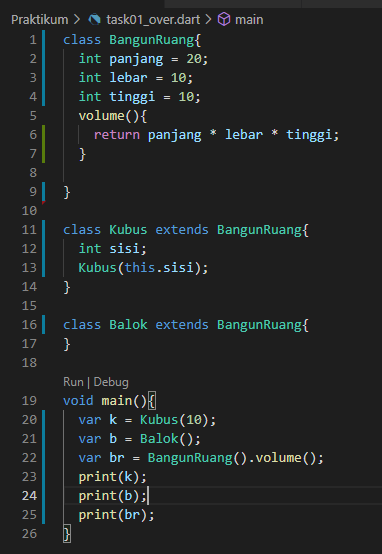

  Pertama membuat sebuah class BangunRuang dengan property panjang, lebar, dan tinggi. Property tersebut sudah berisi nilai dan method volume untuk mencari volume dari BangunRuang.
  Selanjutnya ada class Kubus yaitu child atau anak dari class BangunRuang yang memiliki property sisi.
  Kemudian class Balok yang merupakan child atau anak dari class BangunRuang yang tidak memiliki property sendiri.

  output:

  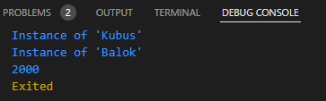

  task 2 : [task02.PNG](./Screenshot/task02.PNG) 

  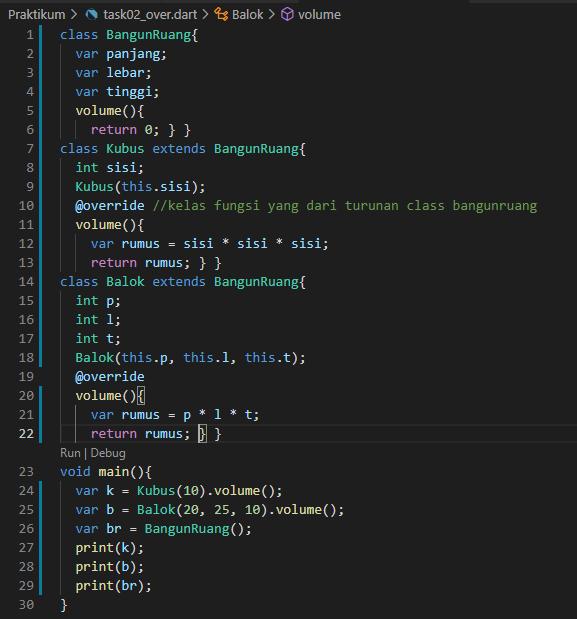

  Pertama membuat sebuah class BangunRuang dengan property panjang, lebar, dan tinggi. Property tersebut sudah berisi nilai dan method volume.
  Selanjutnya ada class Kubus yaitu child atau anak dari class BangunRuang yang memiliki property sisi dan memiliki method volume yang override dari method BangunRuang yang berfungsi untuk mencari volume dari kubus.
  Kemudian class Balok yang merupakan child atau anak dari class BangunRuang yang tidak memiliki property sendiri tetapi memiliki method volume yang override dari class parrentnya, isi dari method volume adalah mencari volume dari balok.

  output:

  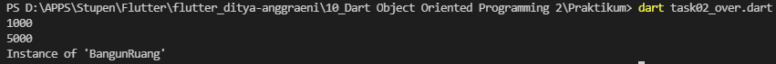

  task 3 : [task03.PNG](./Screenshot/task03.PNG) 

  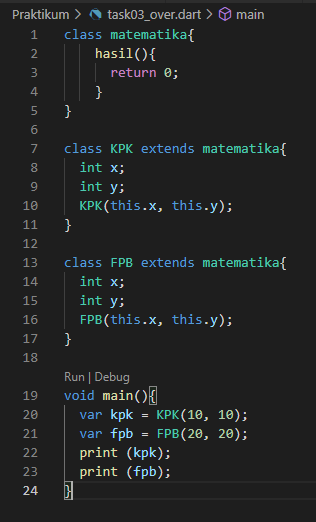

  Membuat sebuah class parent Matematika yang hanya memiliki method hasil dengan return 0.
  Kemudian membuat class KPK dengan extends dari class Matematika yang memiliki property x dan y.
  Lal membuat class FPb dengan extends dari class Matematika yang memiliki property x dan y.

  output:

  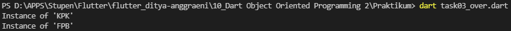

  task 4 : [task04.PNG](./Screenshot/task04.PNG) [task04_2.PNG](./Screenshot/task04_2.PNG)

  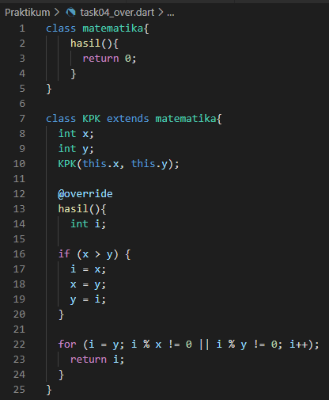
  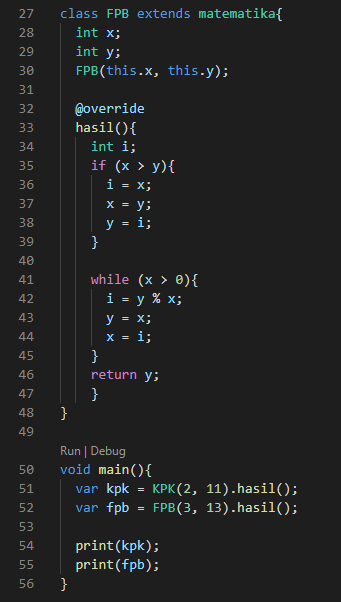

  Membuat sebuah class parent Matematika yang hanya memiliki method hasil dengan return 0.
  Kemudian membuat class KPK dengan extends dari class Matematika yang memiliki property x dan y dan method hasil yang ovrride dari class parrentnya yang berisikan program untuk mencari KPK.
  Lal membuat class FPb dengan extends dari class Matematika yang memiliki property x dan y dan method hasil yang override dari class Matematikan, berisikan program untuk mencari FPB dari 2 bilangan yaitu x dan y.

  output:

  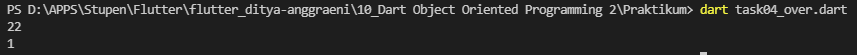

============================================================================================

## Latihan 

  latihan 1 : [Latihan_01.PNG](./Screenshot/Latihan_01.PNG) 

  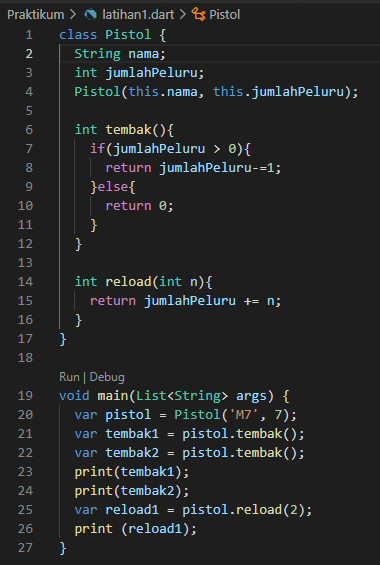 

  Membuat class pistol dengan property nama dan jumlahPeluru kemudian membuat method tembak yang mereturn jumlahPeluru-1 jika jumlaPeluru saat ini lebih besar dari 0 tetapi jika tidak maka return 0 (Tidak terjadi apa-apa) dan method reload yang menambahkan peluru saat ini dengan variabel N.

  output:

  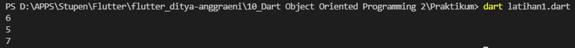

  latihan 2 : [Latihan_02.PNG](./Screenshot/Latihan_02.PNG) 

  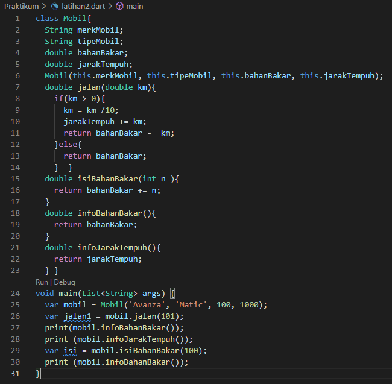 

  membuat class mobil dengan property merkMobil, tipeMobil, bahanBakar, dan jarakTempuh. dengan method jalan yang menambahkan bahanBakar jika variabel km yang diinput lebih dari 0 jika tidak maka return bahanBakar. Kemudian method isiBahanBakar dengan parameter int n yang mereturn bahanBakar + n artinya menambahkan bahanBakar sekarang dengan yang diinput, lalu method infoBahanBakar yang mereturn bahanBakar sekarang dan infoJarakTempuh yang mereturn jarakTempuh sekarang.

  output:

  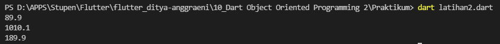

  latihan 3 : [Latihan_03.PNG](./Screenshot/Latihan_03.PNG) 

  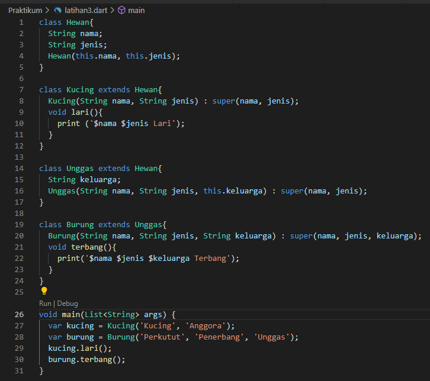
  Membuat class Hewan dengan property nama dan jenis.
  Kemudian membuat class Kucing extends dari class Hewan yang memiliki property sama dengan Hewan dan memiliki method Lari yang berisikan print dari nama, jenis, dan lari.
  Class unggas 

  output:

  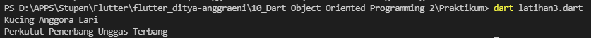

