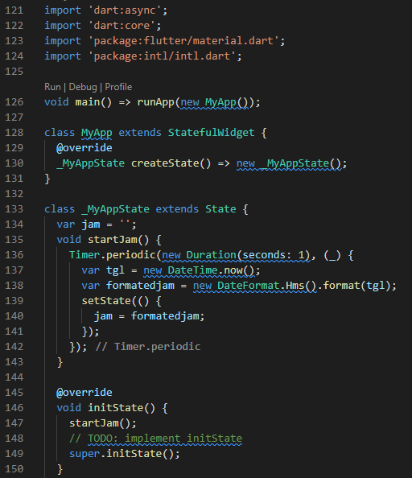
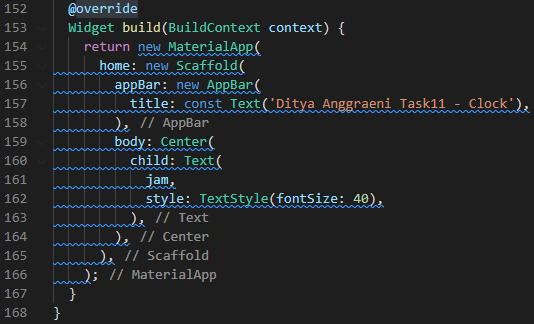
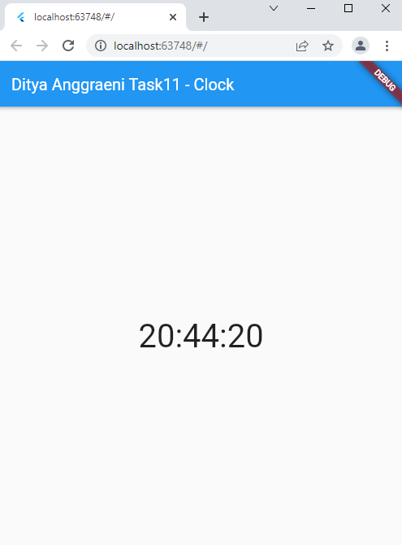
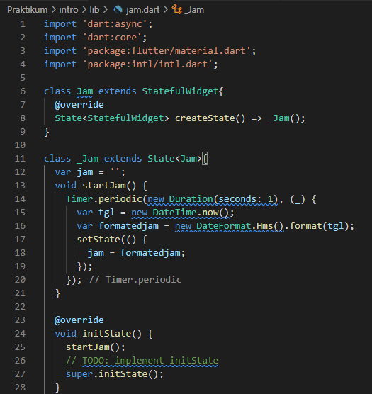
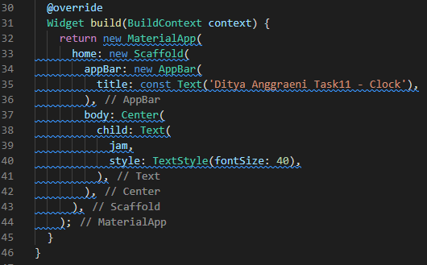
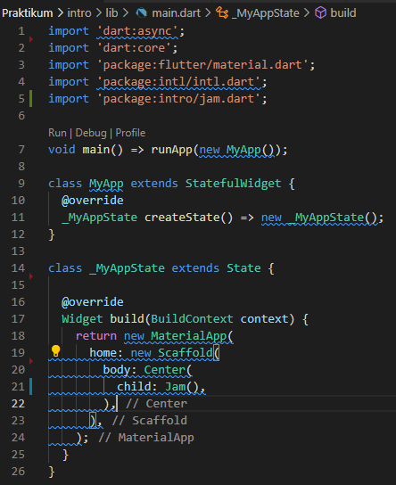

# 11_Introduction Flutter Widget

Nama : Ditya Anggraeni

Program : Become a Flutter Master, From Zero to Hero

Repo : https://github.com/Rae2108/flutter_ditya-anggraeni

## Tuliskan 3 poin yang dipelajari dari materi tersebut. Resume / ringkasan materi dapat disubmit melalui Github

### Jawab : 

1. Apa itu Flutter : flutter merupakan alat pengebangan antarmuka pengguna yang digunakan untuk membuat aplikasi mobile, destop dan web. 
    > Keunggulan Flutter :
        - mudah digunakan dan dipelajari 
        - produktifitas tinggi
        - dokumentasi lengkap
        - komunitas yang berkembang

    > Bagian dari Flutter :
        - SDK (Software Development Kit) alat - alat untuk membantu pengembangan aplikasi
        - Framework merupakan perlengkapan untuk membentuk aplikasi yang dapat dikustomisasi

2. Widget 
        - Digunakan untuk membentuk antar muka (UI)
        - Berupa Class
        - Dapat terdiri dari beberapa widget lainnya.

    > Jenis Widget :
        - Stateless :
            - Tidak bergantung pada perubahan widget lainnya.
            - hanya fokus pada tampilan.
            - dibuat dengan extends pada class statlessWidget.
        
        - Statefull :
            - mementingkan pada perubahan data.
            - Dibuat pada extends class statefull widget.
            - 1 widget menggunakan 2 class ( widget dan state ).

3. Build in Widget : Widget yang dapat langsung digunakan dan sudah terinstall bersama flutter.
    - Contoh :
        - Material App : menggunakan material desain yang biasa untuk pengembangan aplikasi android.
        - Scaffold : untuk membentuk sebuah halaman.
        - App Bar : membentuk aplikasi bar yang terletak pada bagian atas halaman titlle.
        - Text : untuk menampilkan stringtext. 

============================================================================================

## TASK 

 
1.  task 1 : [task1.PNG](./Screenshot/task1.PNG) [task1_1.PNG](./Screenshot/task1_1.PNG)

  
  
  
  Pada dasarnya strukturnya adalah kita membuat timer yang akan mengambil waktu setiap detik menggunakan DateTime dan memperbaharui pada tampilan aplikasi menggunakan setState. 
  Dari halaman default, kita buat void untuk mengambil waktu saat ini dengan DateTime dan memperbaharui variable "jam" dengan setState. Jalankan void dengan initstate. 
  Pada kasus ini kita akan perlu menambahkan dart:async pada halaman kita. Dari sini kita sudah menampilkan waktu dalam format lengkap yaitu tgl dan jam. Selanjutnya kita tinggal ubah saja formatnya menggunakan Dateformat dengan menambahkan package intl. FormatedJam di sini saya tentukan formatnya menjadi Hms yaitu Jam Menit dan Detik saja. jika ingin format yang lain bisa disesuaikan sesuai keinginan.
  
  output:

  

2. taks 2 : [task2.PNG](./Screenshot/task2.PNG) [task2_1.PNG](./Screenshot/task2_1.PNG)  [task2_2.PNG](./Screenshot/task2_2.PNG)

  
  
  
   
   Perbedaan no 1 dengan no 2 adalah cara penulisan, kalau nomor 1 penulisan langsung didalam satu file dan tidak perlu import, tetapi no 2 widget jam dipisah berbeda dengan file main nya jadi ada 2 file yaitu file main dan file widget.

  output :

  