# 12_Platform Widget

Nama : Ditya Anggraeni

Program : Become a Flutter Master, From Zero to Hero

Repo : https://github.com/Rae2108/flutter_ditya-anggraeni

## Tuliskan 3 poin yang dipelajari dari materi tersebut. Resume / ringkasan materi dapat disubmit melalui Github

### Jawab : 

1. Material App merupakan sebuah parent dimana yang diaptnya akan menerapkan style material design. pada material App widget yang pertama kali dibuka diletakkan pada bagian home. mengatur halaman dapat menggunakan routes dan initial route.

2. Scaffold merupakan widget dasar untuk membangun sebuah halaman pada material App.

3. Cupertino App : 
    - widget dasar yang mengemas seluruh widget dalam aplikasi.
    - widget digunakan pada sistem IOS.
    - di import dari package: flutter/cupertino.dart
    
    Cupertino PgeScaffold merupakan dasar untuk membangun sebuah halaman pada cupertinoApp. 

============================================================================================

## TASK 

# Taks 1 :

- Main : [maintask1.PNG](./Screenshot/maintask1.PNG) 
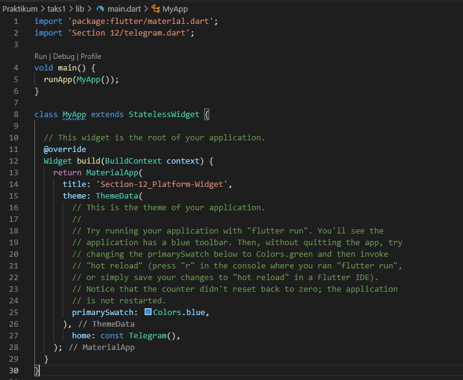 

Merubah kode yang sudah ada dengan menghapus semua class yang tidak dibutuhkan lagi kemudian meruabah title dan home, homenya adalah class Telegram().

- Chartmodel : [chartmodel.PNG](./Screenshot/chartmodel.PNG) 
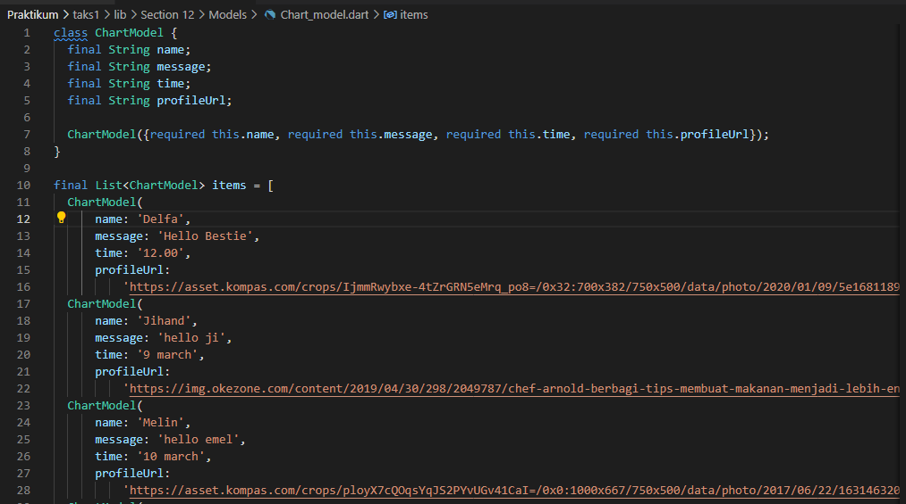

Kemudian membuat chartmodel untuk menampung data chat untuk diimplementasikan didalam program.

- Drawwer : [drawer1.PNG](./Screenshot/drawer1.PNG) [drawer2.PNG](./Screenshot/drawer2.PNG) [drawer3.PNG](./Screenshot/drawer3.PNG)

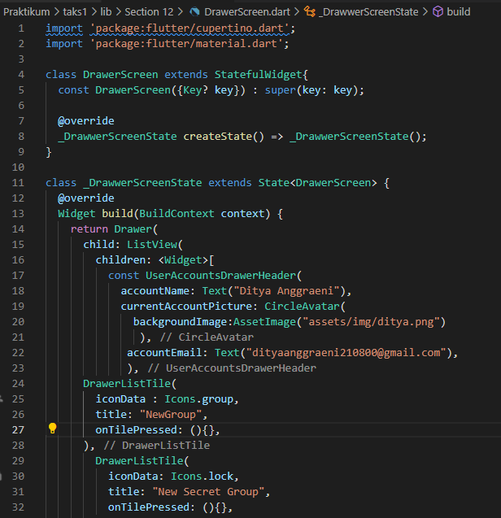 
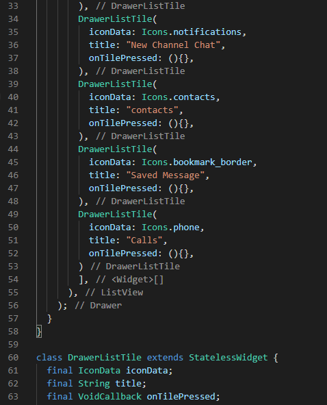 
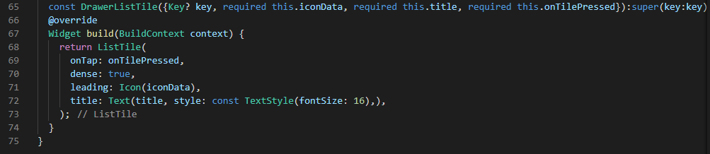

Membuat sidebar/drawer yang berisikan newgroup dengan icon group, New Channel Chat dengan icon notifications, contacts dengan icon contacs, Saved Message dengan icon bookmark_border, Calls dengan icon phone. Seluruh menu belum mendapatkan aksi lebih lanjut.

Telegram : [telegram1.PNG](./Screenshot/telegram1.PNG) [telegram2.PNG](./Screenshot/telegram2.PNG)
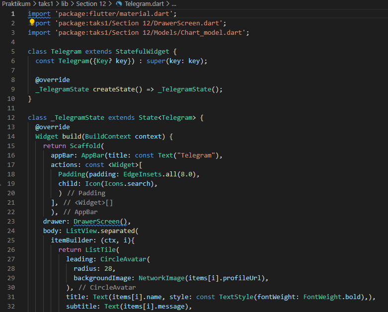
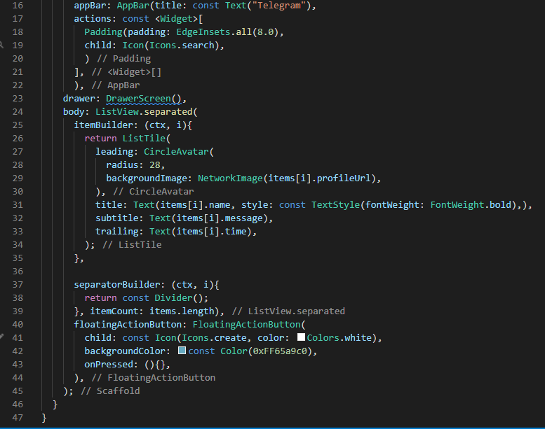

Didalam class Telegram membuat inti bodynya yaitu beberapa chat dari chart model. Jadi semua data yang ada di chartmodel diterapkan di class Telegram

# Taks 2 : 

- Main : [main1.PNG](./Screenshot/main1.PNG) [main2.PNG](./Screenshot/main2.PNG) [main3.PNG](./Screenshot/main3.PNG)

    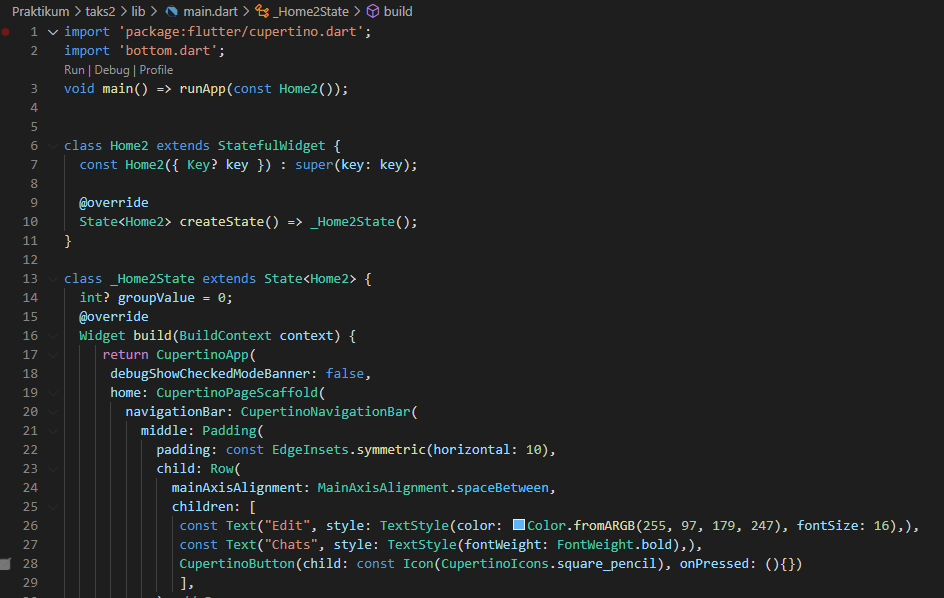  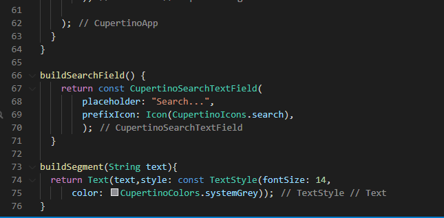

Didalam class Home2 berperan sebagai main yang berisikan inti body dari program menggunakan Cuppertino. Berisikan CuppertinoSliding, CuppertinoSearchTextField.

- Bottom : [bottom1.PNG](./Screenshot/bottom1.PNG) [bottom2.PNG](./Screenshot/bottom2.PNG) [bottom3.PNG](./Screenshot/bottom3.PNG)

    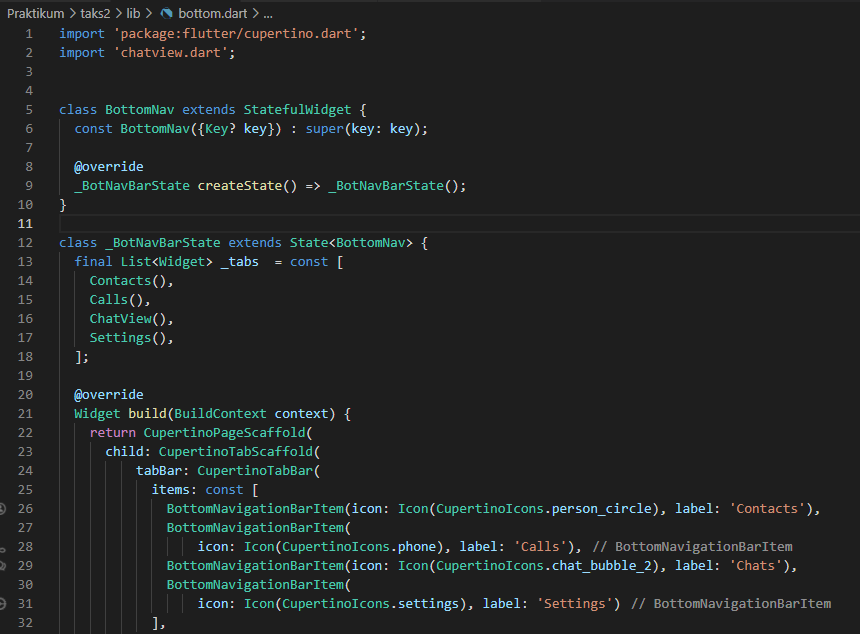 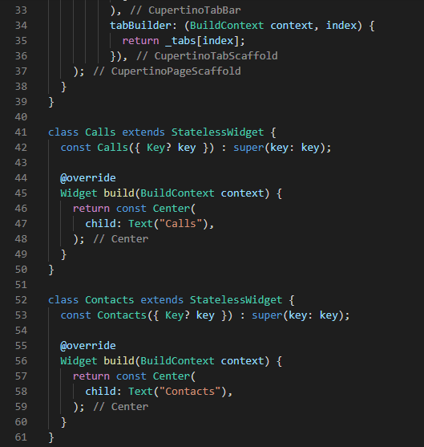
    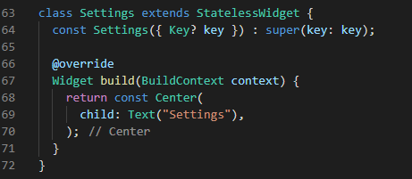

Bottom berisikan tabbar untuk BottomBar, jika salah satu BottomBar dipilih/ditekan maka muncul tabbar. Tabbar yang dibuat hanya tabbar chat, yang berisikan chat dari class ChatView.

- ChatView : [chatview1.PNG](./Screenshot/chatview1.PNG) [chatview2.PNG](./Screenshot/chatview2.PNG)

    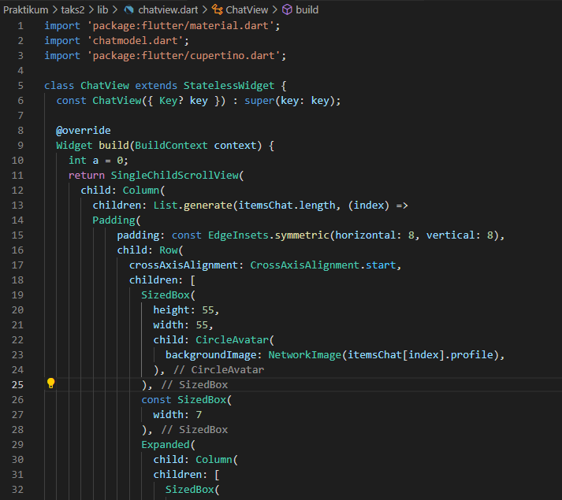 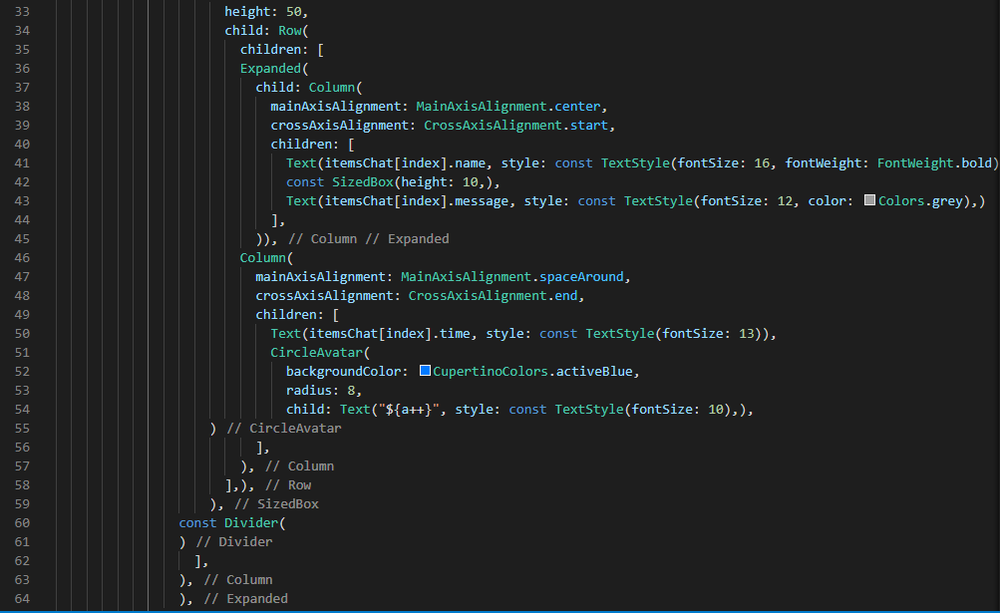

ChatView berisikan kumpulan chat yang menjadi satu, data chat didapat dari class ChatModel.

- ChatModel : [chatmodel.PNG](./Screenshot/chatmodel.PNG)

    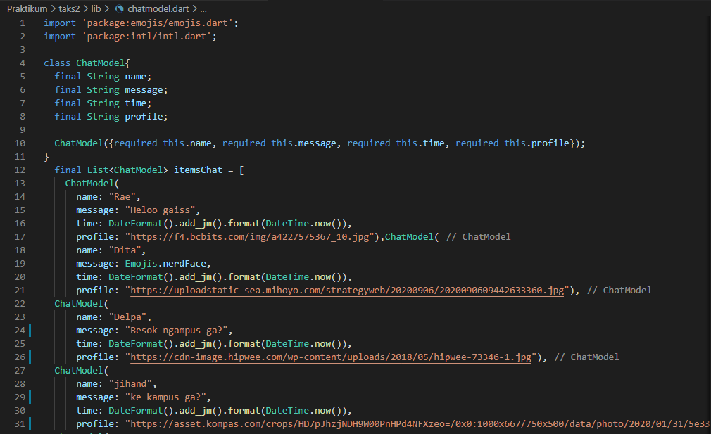

ChatModel berisikan data chat untuk diterapkan di ChatView. 
