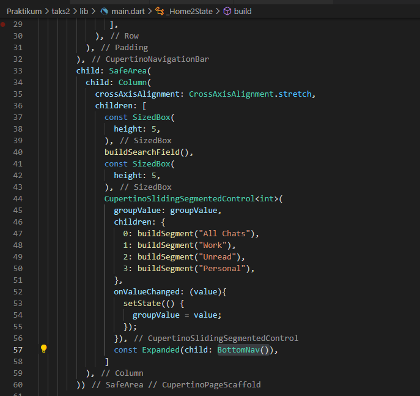

# 12_Platform Widget

Nama : Ditya Anggraeni

Program : Become a Flutter Master, From Zero to Hero

Repo : https://github.com/Rae2108/flutter_ditya-anggraeni

## Tuliskan 3 poin yang dipelajari dari materi tersebut. Resume / ringkasan materi dapat disubmit melalui Github

### Jawab : 

1. Material App merupakan sebuah parent dimana yang diaptnya akan menerapkan style material design. pada material App widget yang pertama kali dibuka diletakkan pada bagian home. mengatur halaman dapat menggunakan routes dan initial route.

2. Scaffold merupakan widget dasar untuk membangun sebuah halaman pada material App.

3. Cupertino App : 
    - widget dasar yang mengemas seluruh widget dalam aplikasi.
    - widget digunakan pada sistem IOS.
    - di import dari package: flutter/cupertino.dart
    
    Cupertino PgeScaffold merupakan dasar untuk membangun sebuah halaman pada cupertinoApp. 

============================================================================================

## TASK 

# Taks 1 :

- Main : [maintask1.PNG](./Screenshot/maintask1.PNG) 
 

- Chartmodel : [chartmodel.PNG](./Screenshot/chartmodel.PNG) 

- Drawwer : [drawerl.PNG](./Screenshot/drawerl.PNG) [drawer2.PNG](./Screenshot/drawer2.PNG) [drawer3.PNG](./Screenshot/drawer3.PNG)

  

Telegram : [telegram1.PNG](./Screenshot/telegram1.PNG) [telegram2.PNG](./Screenshot/telegram2.PNG)

# Taks 2 : 

- Buttom : [buttom1.PNG](./Screenshot/buttom1.PNG) [buttom2.PNG](./Screenshot/buttom2.PNG) [buttom3.PNG](./Screenshot/buttom3.PNG)

     
    

- ChatView : [chatview1.PNG](./Screenshot/chatview1.PNG) [chatview2.PNG](./Screenshot/chatview2.PNG)

     

- ChatModel : [chatmodel.PNG](./Screenshot/chatmodel.PNG)

    

- Main : [main1.PNG](./Screenshot/main1.PNG) [main2.PNG](./Screenshot/main2.PNG) [main3.PNG](./Screenshot/main3.PNG)

       
