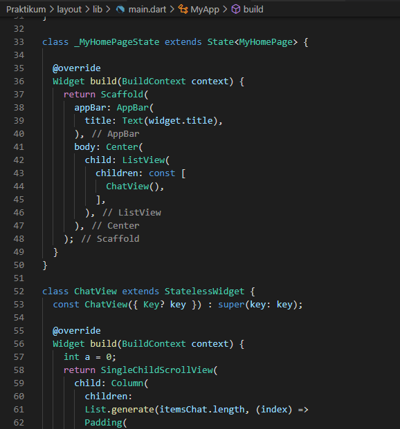
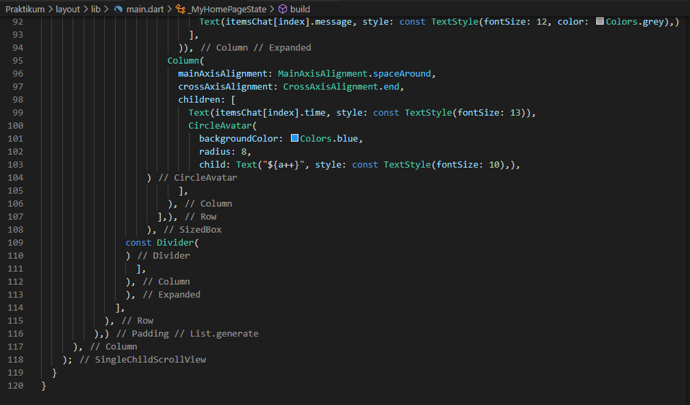
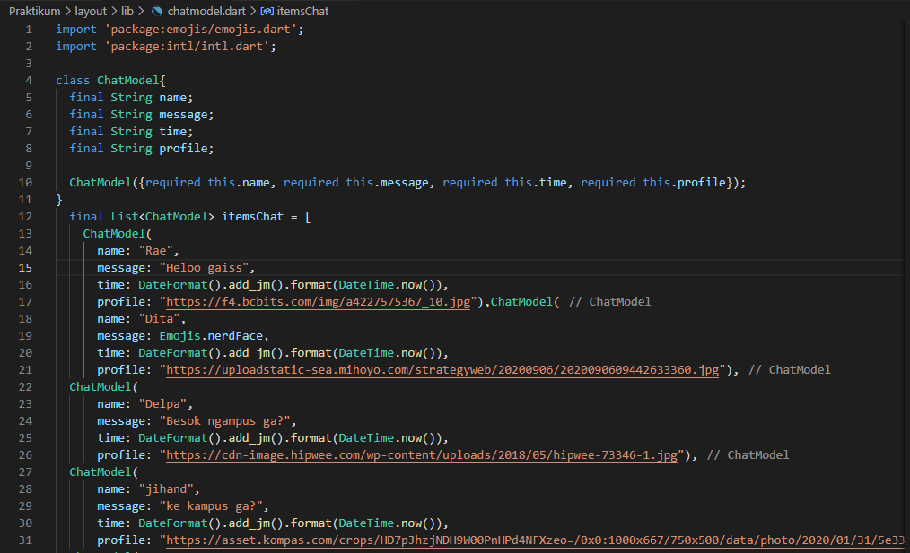

# 14_Flutter Layout

Nama : Ditya Anggraeni

Program : Become a Flutter Master, From Zero to Hero

Repo : https://github.com/Rae2108/flutter_ditya-anggraeni

## Tuliskan 3 poin yang dipelajari dari materi tersebut. Resume / ringkasan materi dapat disubmit melalui Github

### Jawab : 

1. Apa itu Layout : layout digunakan untuk mengatur tata letak, seperti image, text. layout berbentuk widget yang mengatur widget di dalamnya.

2. Single-Child Layout : 
    - Container yang dimana dapat membungkus widget lain sebagai child. Container Box memiliki margin, padding dan border.
    - Center akan memnuhi lebar dan tinggi disetiap ruang luarnya dan dapat membungkus widget lain sebagai childnya, Widget center akan diletakkan dibagian tengah.
    - Sizebox : merupakan bentuk sederhana dari container karena hanya memiliki beberapa komponen seperti child, height dan width jadi hanya untuk mengatur lebar dan tingginya.

3. Multi Child Layout : digunakan untuk meletakkan child lebih dari 1 dan child yang digunakan bertipe array widget.
    - Coloum : Mengatur Widget secara Vertical
    - Row : Mengatur Widget secara Horizontal
    - List View : Mengatur widget dalam bentu lain dan dapat di scroll
    - Grid View : Mengatur widget dalam bentuk galeri.

============================================================================================

## TASK

1. [main1.PNG](./Screenshot/main1.PNG) [main1_1.PNG](./Screenshot/main1_1.PNG) [main1_2.PNG](./Screenshot/main1_2.PNG) [main1_3.PNG](./Screenshot/main1_3.PNG) [chatmodel.PNG](./Screenshot/chatmodel.PNG) 

     

Penggunaan ListView menggunakan Widget ListView kemudian didalam ListView gunakan kode dan list chat yang sudah dibuat sebelumnya.

Output : 

2. [main_2.PNG](./Screenshot/main2.PNG) [main_2-1.PNG](./Screenshot/main2-1.PNG) [main_2-2.PNG](./Screenshot/main2-2.PNG) [main_2-3.PNG](./Screenshot/main2-3.PNG)

   

Untuk menggunakan GridView gunakan Widget GridView.count kemudian didalamnya berisikan properti :
    - primary: false,
    - padding: const EdgeInsets.all(20),
    - crossAxisSpacing: 10,
    - mainAxisSpacing: 10,
    - crossAxisCount: 4,
Artinya dalam satu baris terdapat 4 gambar/kotak/ikon, dapat diatur dibagian crossAxisCount lalu untuk spasi/jarak antara kotak/ikon berada di mainAxisSpacing. Penggunaan container untuk menempatkan icon agar dapat membuat background pada containernya agar terlihat jelas jaraknya.

Output : 

