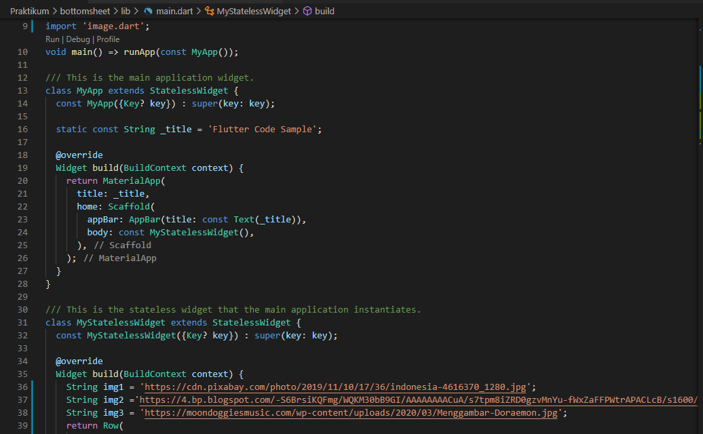
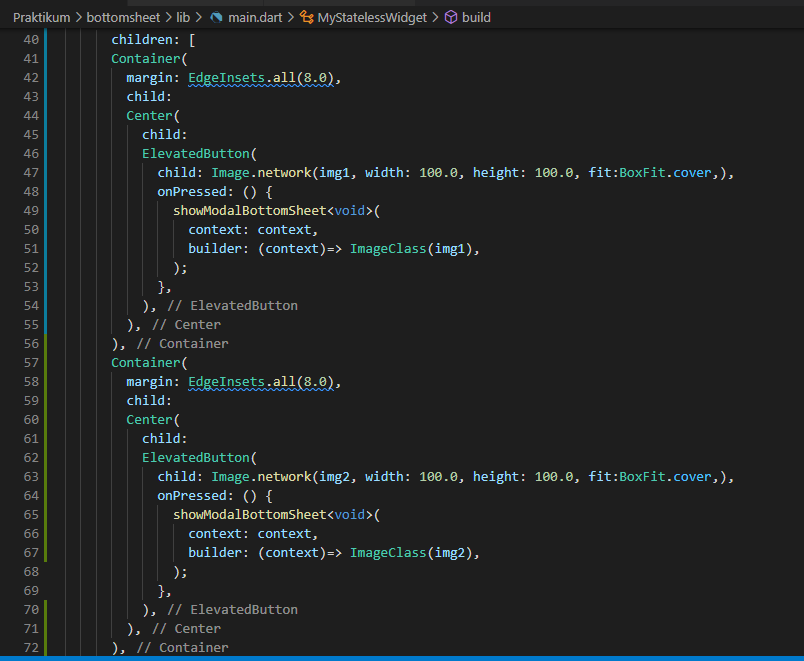
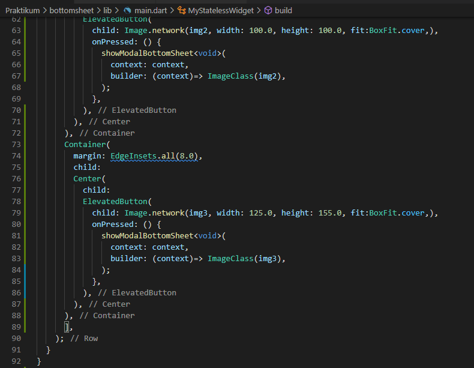
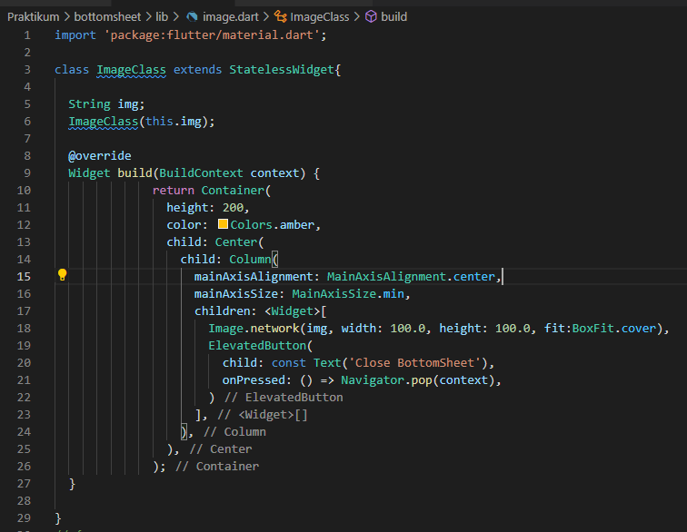

# 15_Dialog Bottom Sheet

Nama : Ditya Anggraeni

Program : Become a Flutter Master, From Zero to Hero

Repo : https://github.com/Rae2108/flutter_ditya-anggraeni

## Tuliskan 3 poin yang dipelajari dari materi tersebut. Resume / ringkasan materi dapat disubmit melalui Github

### Jawab : 

1. Aplikasi Task Management = Untuk menambahkan dan menghapus kegiatan

2. Alert Dialog :
    - Untuk tampilan android dari material design
    - Menginformasikan pengguna tentang situasi tertentu
    - Bisa digunakan untuk mendapatkan input dari user
    - Membutuhkan helper method show dialog

3. Bottom Sheet :
    - Seperti dialog tetapi muncul dari bawah layar aplikasi
    - Menggunakan Fungsi bawaan Flutter ShowModeBottomSheet
    - Membutuhkan dua properti, yaitu Context dan Builder

============================================================================================

## TASK

1. [main1.PNG](./Screenshoot/main1.PNG) [main1_1.PNG](./Screenshoot/main1_1.PNG) [main1_2.PNG](./Screenshoot/main1_2.PNG)
[image.PNG](./Screenshoot/image.PNG)

  

Pembuatan galery menggunakan widget Row, kemudian membuat container untuk menampung gambar dan memberikan jarak antara gambarnya. Untuk gambarnya agar dapat diklik, saya menggunakan Widget ElevatedButton supaya image/gambar yang ada dapat di klik lalu buat aksi showModalBottomSheet untuk menampilkan bottom sheet kemudian pada clas ImageClass untuk menampilkan gambar yang diklik pada BottomSheet.

Output : 

