# 16_Form Input Button

Nama : Ditya Anggraeni

Program : Become a Flutter Master, From Zero to Hero

Repo : https://github.com/Rae2108/flutter_ditya-anggraeni

## Tuliskan 3 poin yang dipelajari dari materi tersebut. Resume / ringkasan materi dapat disubmit melalui Github

### Jawab : 

1. 
============================================================================================

## TASK

- [card1.PNG](./Screenshot/card1.PNG) [card1.PNG](./Screenshot/card1.PNG)

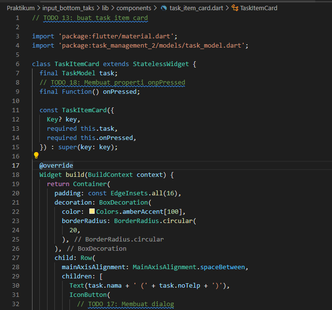 

- [empty.PNG](./Screenshot/empty.PNG)

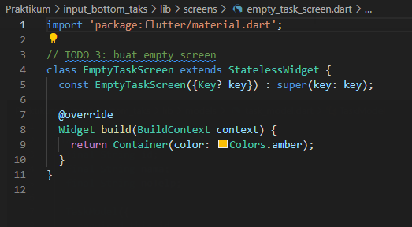

- [itemscreen.PNG](./Screenshot/itemscreen.PNG) [itemscreen1.PNG](./Screenshot/itemscreen1.PNG) [itemscreen2.PNG](./Screenshot/itemscreen2.PNG) [itemscreen3.PNG](./Screenshot/itemscreen3.PNG) [itemscreen4.PNG](./Screenshot/itemscreen4.PNG) 

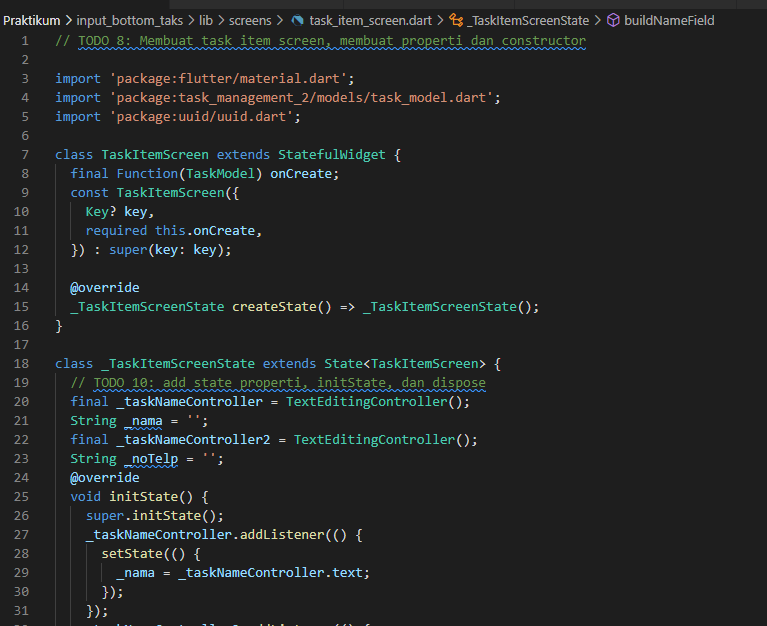 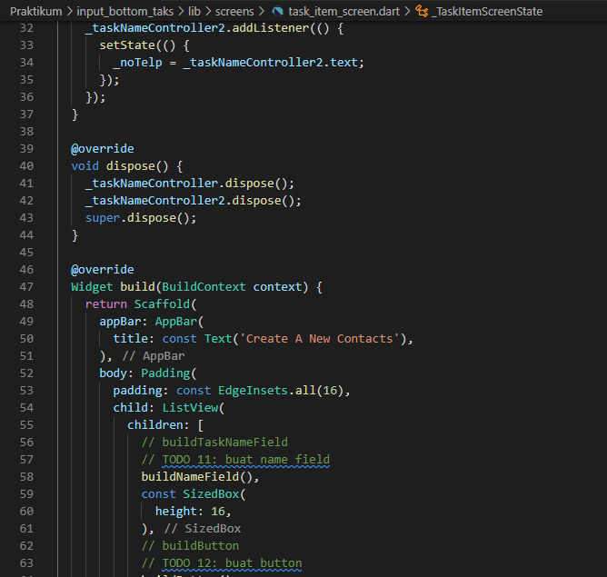 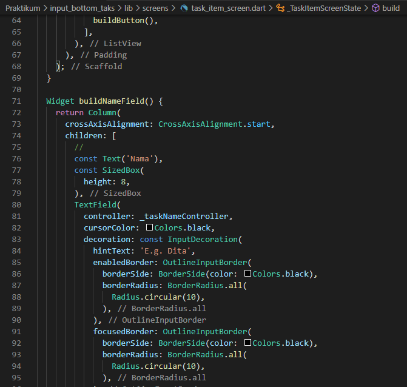 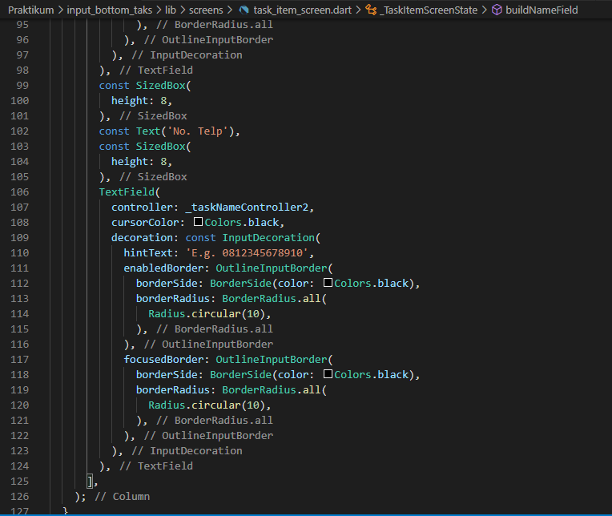 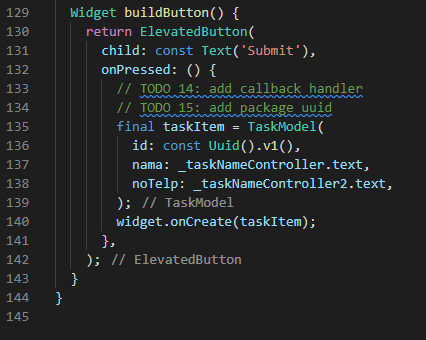 

- [listscreen.PNG](./Screenshot/listscreen.PNG) [listscreen1.PNG](./Screenshot/listscreen1.PNG)

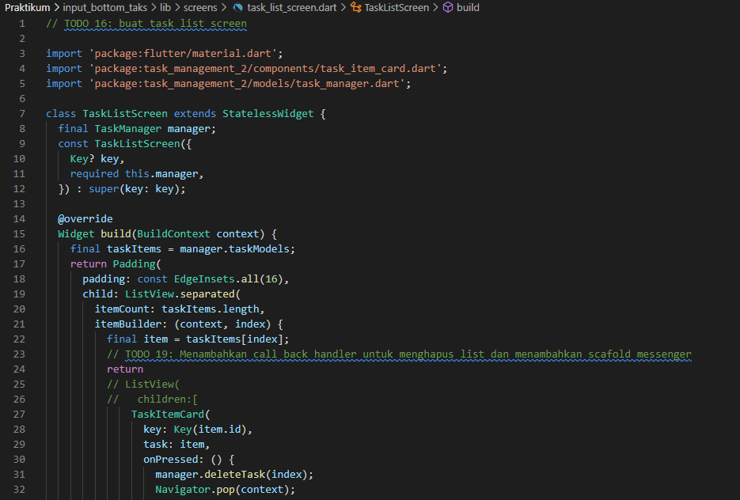 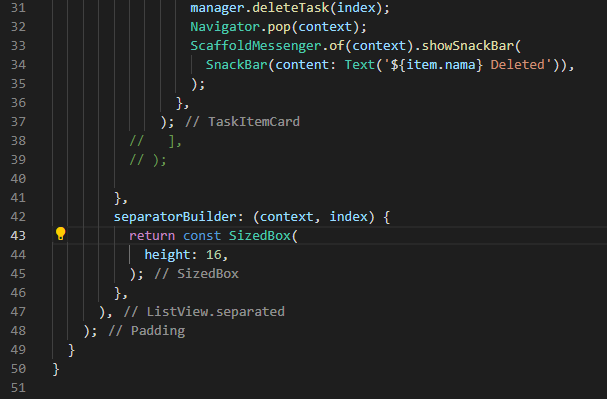

- [main1.PNG](./Screenshot/main1.PNG) [main2.PNG](./Screenshot/main2.PNG) [main3.PNG](./Screenshot/main3.PNG)

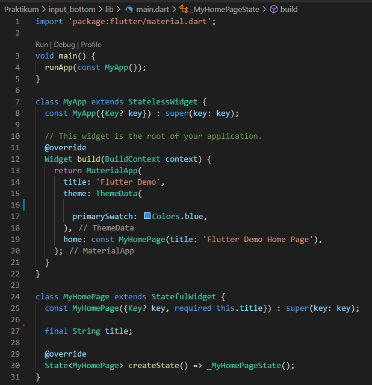 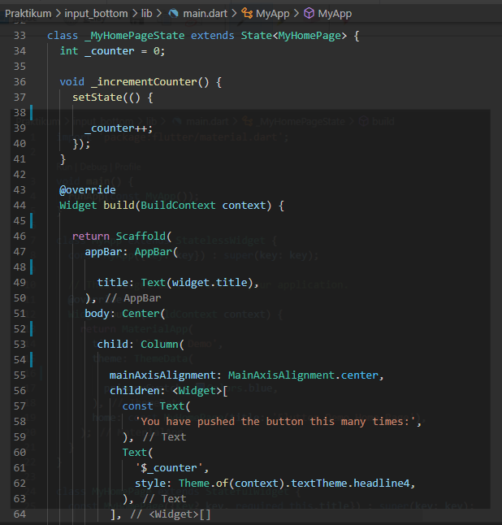 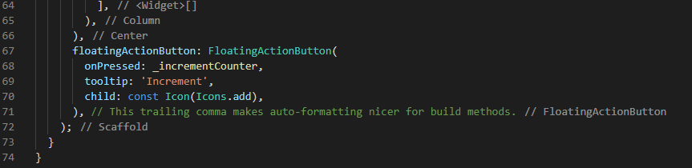

- [mainscreen.PNG](./Screenshot/mainscreen.PNG)
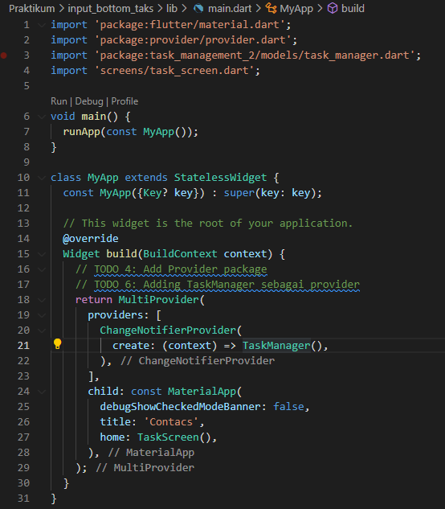

- [manager.PNG](./Screenshot/manager.PNG)

- [model.PNG](./Screenshot/model.PNG)

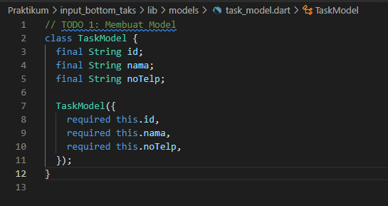

- [taskscreen.PNG](./Screenshot/taskscreen.PNG) [taskscreen1.PNG](./Screenshot/taskscreen1.PNG) [taskscreen2.PNG](./Screenshot/taskscreen2.PNG)

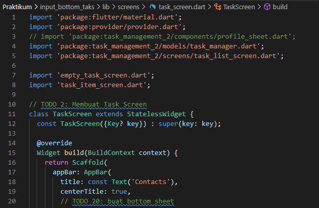 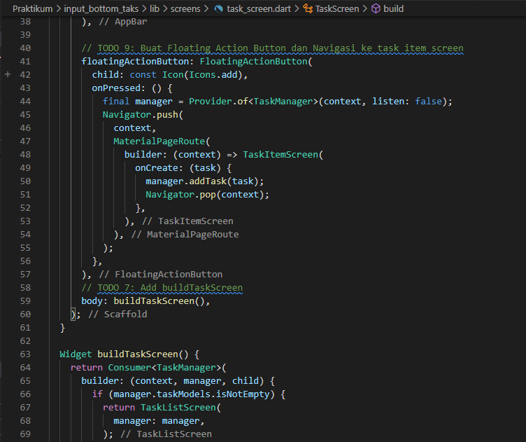 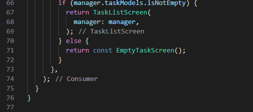