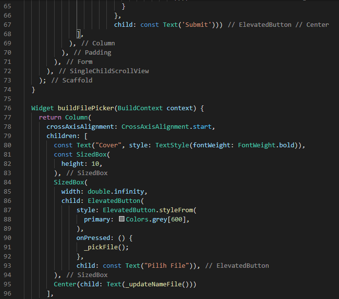

# 17_Form Picker

Nama : Ditya Anggraeni

Program : Become a Flutter Master, From Zero to Hero

Repo : https://github.com/Rae2108/flutter_ditya-anggraeni

## Tuliskan 3 poin yang dipelajari dari materi tersebut. Resume / ringkasan materi dapat disubmit melalui Github

### Jawab : 

1. Data Picker merupakan widget dimana user bisa memasukkan tanggal. Contoh seperti tanggal kelahiran, waktu pemesanan tiket, waktu reservasi restoran dll.
    - Cara Membuat Data Picker
        o Menggunakan fungsi bawaan Flutter ShowDatePicker
        o Fungsi ShowDatePicker memiliki tipe data future
        o Menampilkan ialog material design date picker
        o Menambahkan packages Intl ddi Pubspec.yaml
        o Mempersiapkan variable
        o Membangun UI
        o Menambahkan ShowDatePicker di dalam on prossed
        o Memanggil fungsi state di dalam on prossed

2. Color Picker merupakan widget dimana user dapat memilih color penggunaan color picker bisa digunakan untuk berbagai macam kondisi.

    - Cara membuat Color Picker
        o Menggunakan packages Flutter_Collorpicker
        o Menambahkan packages Flutter_Collorpicker di pubspec.yaml
        o Mempersiapkan variable
        o Membangun UI
        o Menambahkan fungsi ShowDialog didalam on prossed dengan return WidgetAlertDialog.
        o Import packages Flutter_collorpicker dalam file.dart
        o Membuat kode untuk penggunaan packages Flutter_Collorpicker

3. file picker merupakan kemampuan widget untuk mengakses storage serta dapat memilih dan membuka file.

    - Cara membuat File Picker
        o Menggunakan packages file_picker dan open_file
        o Menambahkan packages file_picker dan open_file di pubspec.yaml
        o Import packages file_picker dan open_file dalam file dart
        o Membangun UI
        o Membuat fungsi untuk mengeksplore dan memilih files dari storage
        o Memanggil fungsi_pic file didalam onpressed
        o Membuat fungsi untuk membuka file yang telah dipilih 
        o Mengambil file dari objek result dan memanggil fungsi_open file di dalam fungsi_picfile.

============================================================================================

## TASK

- [home1.PNG](./Screenshots/home1.PNG) [home2.PNG](./Screenshots/home2.PNG)  [home3.PNG](./Screenshots/home3.PNG)  [home4.PNG](./Screenshots/home4.PNG) [home5.PNG](./Screenshots/home5.PNG) [home6.PNG](./Screenshots/home6.PNG) [home7.PNG](./Screenshots/home7.PNG)

        

Pada file home.dart menggunakan library atau widget yaitu file_picker, date_field, dan flutter_colorpicker.
Memiliki fungsi masing-masing yaitu : 
    - File Picker, membuat inputan berupa file dengan memilih file yang ada pada device.
    - Date Field, membuat inputan berupa tanggal dengan memilih tanggal.
    - Color Picker, membuat inputan berupa memilih warna yang telah disediakan.
Layout menggunakan Scaffold.

- [mainscreen.PNG](./Screenshots/mainscreen.PNG)

- [priview1.PNG](./Screenshots/priview1.PNG) [priview2.PNG](./Screenshots/priview2.PNG)

 

Pada priview.dart menerima inputan yang ada di main.dart kemudian menerapkan atau menggnakannya pada tampilan, untuk file picker ditampilkan dalam bentuk gambar atau image.

- [Output1.png](./Screenshots/Output1.png)

- [Output2.png](./Screenshots/Output2.png)

