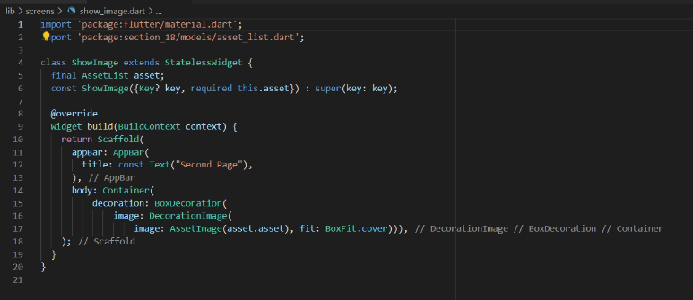

# 18_Assets

Nama : Ditya Anggraeni

Program : Become a Flutter Master, From Zero to Hero

Repo : https://github.com/Rae2108/flutter_ditya-anggraeni

## Tuliskan 3 poin yang dipelajari dari materi tersebut. Resume / ringkasan materi dapat disubmit melalui Github

### Jawab : 

1. Form : Menerima isian data dari pengguna.

2. Alert Dialog digunakan untuk :
    o Untuk tampilan android dari material design
    o Bisa digunakan untuk mendapatkan input dari user
    o Membutuhkan helper method show dialog

3. Bottom Sheets : 
    o Seperti dialog tetapi muncul dari bawah layar aplikasi
    o Menggunakan fungsi bawaan flutter ShowModalBottomSheets
    o Membutuhkan dua properti yaitu context dan builder

============================================================================================

## TASK

- [asset_list.PNG](./Screenshots/asset_list.PNG)

Membuat aseets yang dibutuhkan, aseets yang dibutuhkan adalah 3 gambar. Untuk mempermudah dibuatlah assets list.

- [genereted.PNG](./Screenshots/genereted.PNG)

- [home1.PNG](./Screenshots/home1.PNG) [home2.PNG](./Screenshots/home2.PNG)

 

Pada home.dart, memuat output seperti galery menggunakan scaffold dan gridview. Jika gambar yang tersedia diklik atau ditekan, muncul widget dari show image.

- [show_image.PNG](./Screenshots/show_image.PNG)

Show image untuk memunculkan gambar penuh dari home yang di klik.

- [main.PNG](./Screenshots/main.PNG)

- [Output1.png](./Screenshots/Output1.png)

- [Output2.png](./Screenshots/Output2.png)

