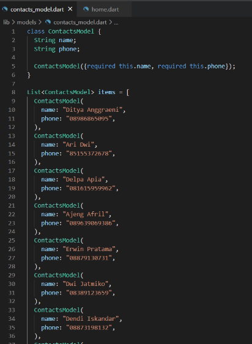
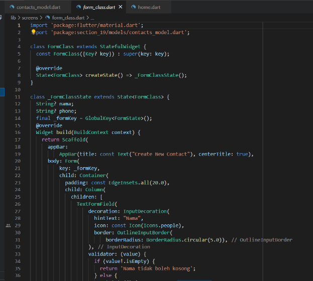
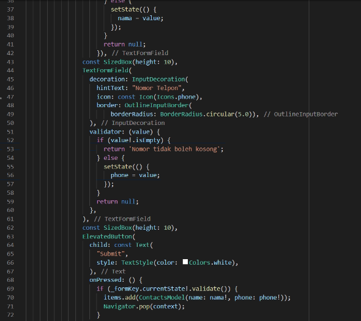
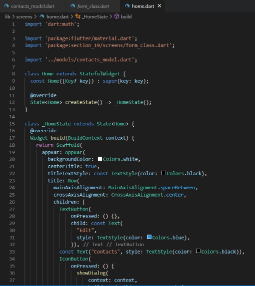
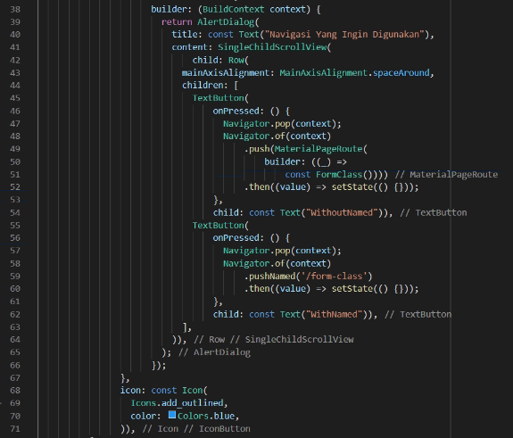
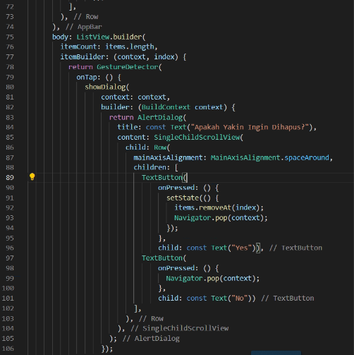
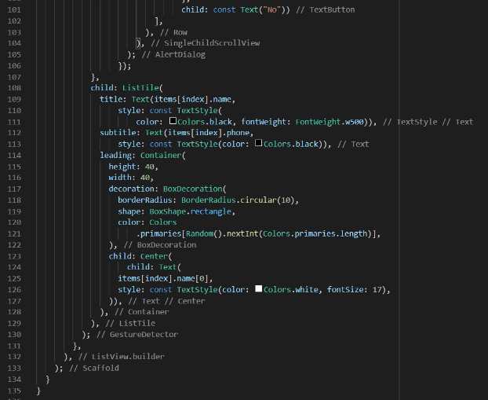
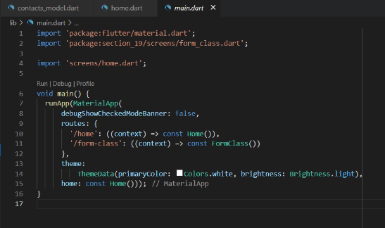

# 19_Flutter Navigation

Nama : Ditya Anggraeni

Program : Become a Flutter Master, From Zero to Hero

Repo : https://github.com/Rae2108/flutter_ditya-anggraeni

## Tuliskan 3 poin yang dipelajari dari materi tersebut. Resume / ringkasan materi dapat disubmit melalui Github

### Jawab : 

1. Navigation merupakan tampilan yang berpindah dari halaman 1 ke halaman lainnya. Untuk berpindah halaman selanjutnya menggunakan perintah “Navigation.push(), sedangkan untuk ke halaman sebelumnya menggunakan perintah “Navigation.pop().

2. Navgation dengan named routes dimana setiap halaman memiliki alamat yang disebut route. Untuk pinda ke halaman lain menggunakan perintah “Navigator.pushNamed()”, untuk pindah kehalaman sebelumnya menggunakan perintah “Navigator.pop()”. 

3. Jika ingin menggunakan routes maka harus didaftarkan dengan menambahkan InitialRoute dan routes pada material App dan setiap routes merupakan fungsi yang membentuk halaman. Mengirim data kehalaman baru dapat menggunakan arguments saat melakukan pushNamed.

============================================================================================

## TASK

- [contacs_model.PNG](./Screenshots/contacs_model.PNG)

- [form_class.PNG](./Screenshots/form_class.PNG) [form_class1.PNG](./Screenshots/form_class1.PNG)

 

- [home1.PNG](./Screenshots/home1.PNG) [home2.PNG](./Screenshots/home2.PNG) [home3.PNG](./Screenshots/home3.PNG) [home4.PNG](./Screenshots/home4.PNG)

   

- [main.PNG](./Screenshots/main.PNG)

- [Output1.PNG](./Screenshots/Output1.PNG)

- [Output2.PNG](./Screenshots/Output2.PNG)

- [Output3.PNG](./Screenshots/Output3.PNG)

