# 20_Flutter State Management (Provider)

Nama : Ditya Anggraeni

Program : Become a Flutter Master, From Zero to Hero

Repo : https://github.com/Rae2108/flutter_ditya-anggraeni

## Tuliskan 3 poin yang dipelajari dari materi tersebut. Resume / ringkasan materi dapat disubmit melalui Github

### Jawab : 

1. State merupakan data yang dapat dibaca saat pembuatan widget dan dapat berubah saat widget sedang aktif serta hanya dimiliki oleh StatefullWidget. State dapat dibuat sebagai property dari class dan digunakan pada widget saat build, untuk mengubah state dapat menggunakan method set state.

2. Global state merupakan state yang digunakan seburuh aplikasi alasan mengapa harus memakai global state supaya widget dapat memanfaatkan state yang sama dengan mudah. Contohnya pada keranjang e-commerce.

3. State manajemen yang lebih kompleks datap menggunakan provider dan provider tersebut perlu di install.
    o Langkah installasi provider
        - Menambahkan package provider pada bagian elependencier dalam file pubspec.yaml
        - Jalankan perintah pub get.

    o Langkah membuat state provider
        - Buat file contact.dart
        - Definisikan state dalam bentuk class
    
    o Langkah mendaftarkan state provider
        - Import dalam file main.dart
        - Daftarkan pada runApp dengan multi provider

    o Langkah menggunakan state provider
        - Menyimpan provider dalam variable
        - Ambil data dari provider melalui getter

============================================================================================

## TASK

- [conmen.PNG](./Screenshots/conmen.PNG)

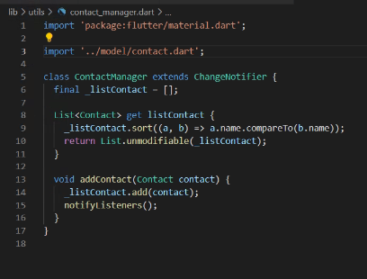

- [contact.PNG](./Screenshots/contact.PNG)

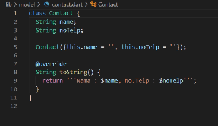

- [home1.PNG](./Screenshots/home1.PNG) [home2.PNG](./Screenshots/home2.PNG)

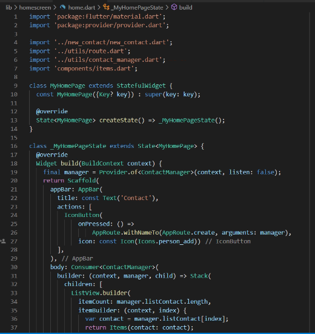 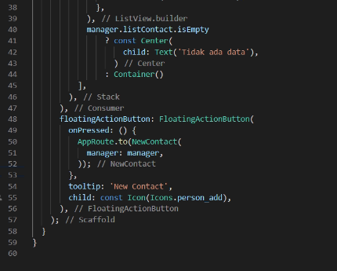

- [items.PNG](./Screenshots/items.PNG)

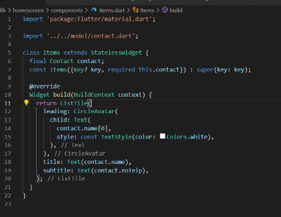

- [namecon1.PNG](./Screenshots/namecon1.PNG) [namecon2.PNG](./Screenshots/namecon2.PNG)

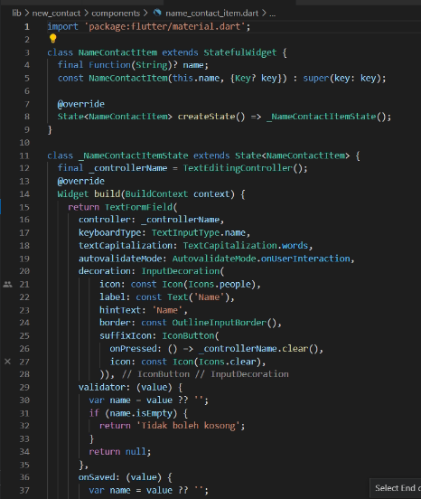 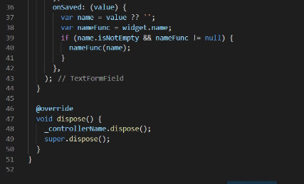

- [newcon1.PNG](./Screenshots/newcon1.PNG) [newcon2.PNG](./Screenshots/newcon2.PNG)

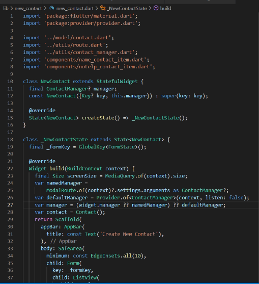 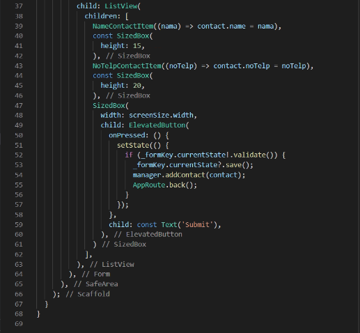

- [notlp1.PNG](./Screenshots/notlp1.PNG) [notlp2.PNG](./Screenshots/notlp2.PNG)

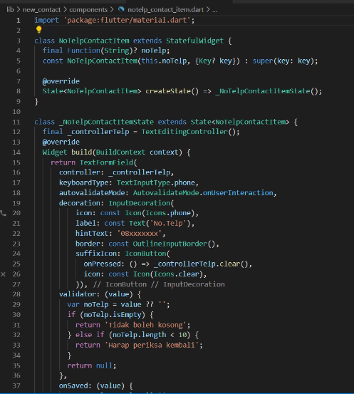 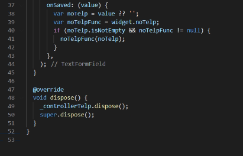

- [route.PNG](./Screenshots/route.PNG)

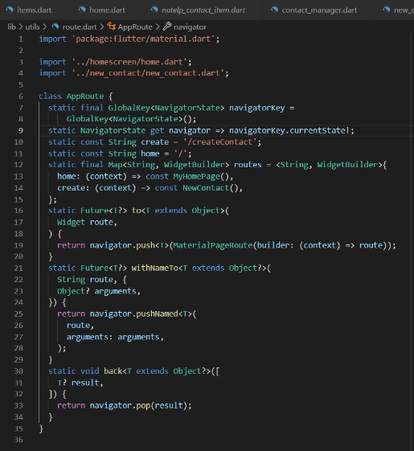

- [Output1.PNG](./Screenshots/Output1.PNG)

- [Output2.PNG](./Screenshots/Output2.PNG)

- [Output3.PNG](./Screenshots/Output3.PNG)

