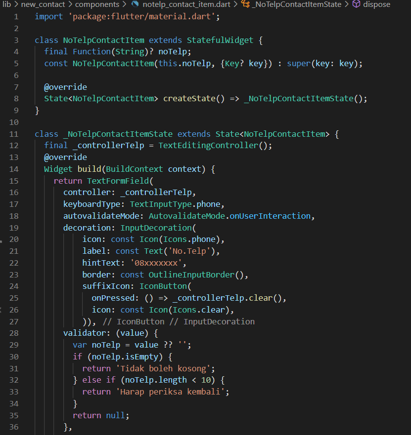

# 21_Flutter State Management (BLoC)

Nama : Ditya Anggraeni

Program : Become a Flutter Master, From Zero to Hero

Repo : https://github.com/Rae2108/flutter_ditya-anggraeni

## Tuliskan 3 poin yang dipelajari dari materi tersebut. Resume / ringkasan materi dapat disubmit melalui Github

### Jawab : 

1. BLoC (Business Logic Component) yang memisahkan business logic dengan UI/Widget
    - Keunggulan BLoC :
        1. Simple dan mudah digunakan
        2. Powerfull dapat mempercepat proses tertentu
        3. Testable dapat mempermudah pengujian

    - Cara kerja BLoC : 
        1. Menerima event sebagai input 
        2. Dianalisa dan dikelola dalam BLoC
        3. Menghasilkan state sebagai input

2. Stream merupakan rangkaian proses secara asynchronous dan actor utamma dalam BLoC.

3. Declrative UI pada flutter artinya untuk membangun UI pada screen mencerminkan keadaan saat ini

============================================================================================

## TASK

- [AppRoute.png](./Screenshots/AppRoute.png)

- [Bloc.png](./Screenshots/Bloc.png)

- [contact_item.png](./Screenshots/contact_item.png) [contact_item2.png](./Screenshots/contact_item2.png)

 

- [EnterExit_AppRoute.png](./Screenshots/EnterExit_AppRoute.png)

- [Event.png](./Screenshots/Event.png) [Event2.png](./Screenshots/Event2.png)

 

- [Favorite.png](./Screenshots/Favorite.png)

- [Home.png](./Screenshots/Home.png) [Home2.png](./Screenshots/Home2.png)

 

- [items.png](./Screenshots/items.png) [items2.png](./Screenshots/items2.png) [items3.png](./Screenshots/items3.png)

  

- [Maindart.png](./Screenshots/Maindart.png)

- [name_contact_item.png](./Screenshots/name_contact_item.png) [name_contact_item2.png](./Screenshots/name_contact_item2.png) 

  

- [new_contact_screen.png](./Screenshots/new_contact_screen.png) [new_contact_screen2.png](./Screenshots/new_contact_screen2.png) 

  

- [State.png](./Screenshots/State.png) [State2.png](./Screenshots/State2.png)

 

- [Output1.png](./Screenshots/Output1.png)

- [Output2.png](./Screenshots/Output2.png)

- [Output3.png](./Screenshots/Output3.png)

