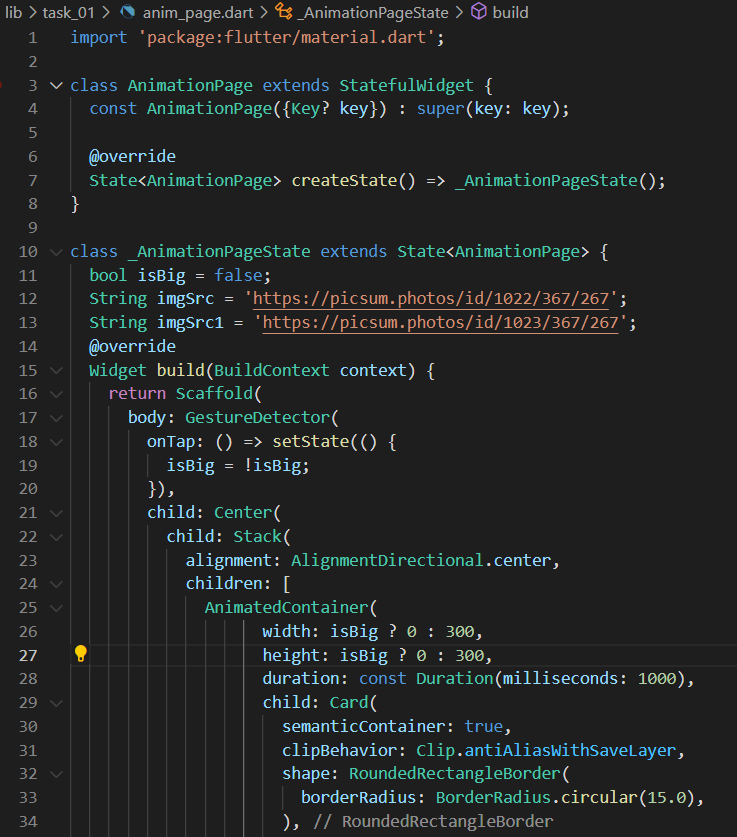
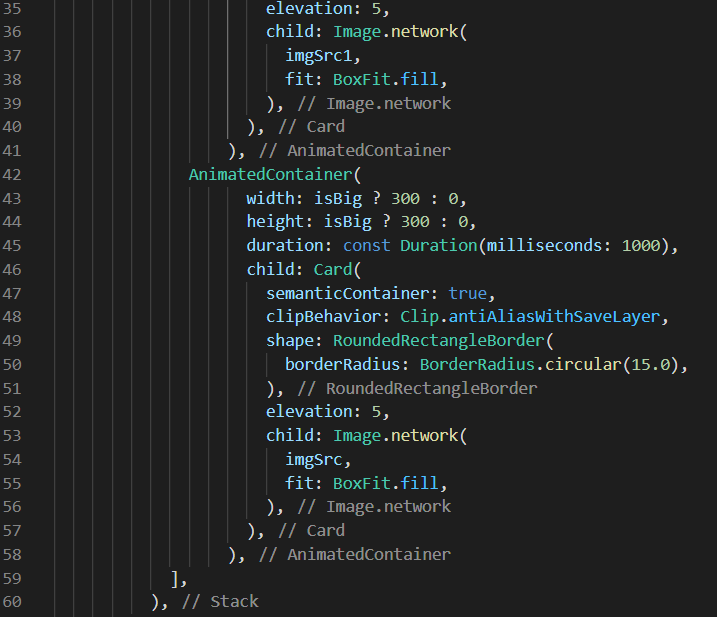
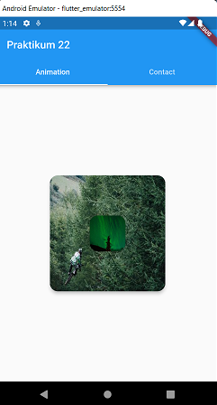

# 22_Flutter Animation

Nama : Ditya Anggraeni

Program : Become a Flutter Master, From Zero to Hero

Repo : https://github.com/Rae2108/flutter_ditya-anggraeni

## Tuliskan 3 poin yang dipelajari dari materi tersebut. Resume / ringkasan materi dapat disubmit melalui Github

### Jawab : 

1. Animation dapat membuat aplikasi terlihat hidup dengan adanya widget yang bergerak dapat menambahkan daya tarik tersendiri dari suatu aplikasi. 

2. Implicit Animation merupakan versi animasi widget yang sudah ada, tanpa adanya animasi perubahan ukuran container tampak terlihat kaku.

3. Transition animasi yang terjadi saat perpindahan halaman yang dapat dilakukan pada bagian navigator push()

============================================================================================

## TASK

- [anim_page.png](./Screenshots/anim_page.png) [anim_page2.png](./Screenshots/anim_page2.png)

 

- [Output1.png](./Screenshots/Output1.png) 

