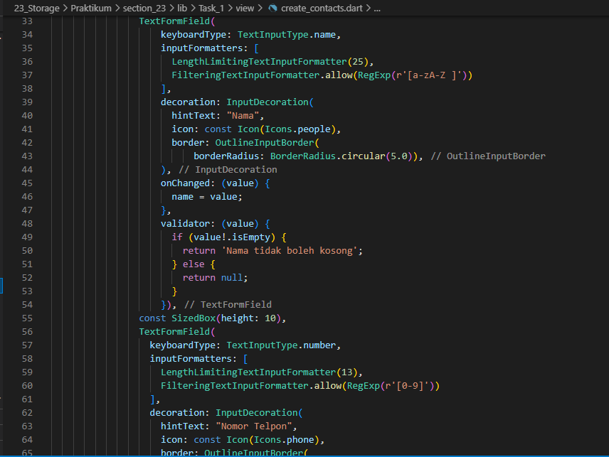

# 23_Storage

Nama : Ditya Anggraeni

Program : Become a Flutter Master, From Zero to Hero

Repo : https://github.com/Rae2108/flutter_ditya-anggraeni

## Tuliskan 3 poin yang dipelajari dari materi tersebut. Resume / ringkasan materi dapat disubmit melalui Github

### Jawab : 

1. Penyimpanan lokal diperlukan untuk efisiensi penggunaan data internet, cara mengimplementasikannya dapat dengan Shared Preferences dan Local Database.

2. Shared Preference dapat menyimpan data yang sederhana penyimpanan berformat key-value, tipe data penyimpanan nya dapat berupa angka, teks, dan boolean. contoh penggunaannya seperti menyimpan data login dan menyimpan riwayat pencarian.

3. Local Database (SQLite) dapat menyimpan dan meminta data dalam jumlah besar pada local device dan bersifat private, penggunaannya melalui package sqflite dan dapat mendukung insert, read, update dan remove data. 

============================================================================================

## TASK

- [bloc2.PNG](./Screenshots/bloc2.PNG) [bloc2_1.PNG](./Screenshots/bloc2_1.PNG)

 

Potongan program diatas adalah storage yang menggunakan Bloc.

- [conmanager1.PNG](./Screenshots/conmanager1.PNG)

Sedangkan potongan program diatas adalah storage yang menggunakan sharedpreferences

- [conmanager2.PNG](./Screenshots/conmanager2.PNG)

- [conmanagerstate2.PNG](./Screenshots/conmanagerstate2.PNG)

Potongan program diatas adalah kontak manager untuk bloc

- [conmodel1.PNG](./Screenshots/conmodel1.PNG)

Potongan program diatas adalah model untuk sharedpreferences.

- [conmodel2.PNG](./Screenshots/conmodel2.PNG)

Sedangkan potongan program diatas adalah model untuk bloc

- [conscreen1.PNG](./Screenshots/conscreen1.PNG) [conscreen1_1.PNG](./Screenshots/conscreen1_1.PNG) [conscreen1_2.PNG](./Screenshots/conscreen1_2.PNG)
  

- [conscreen2.PNG](./Screenshots/conscreen2.PNG) [conscreen2_1.PNG](./Screenshots/conscreen2_1.PNG) [conscreen2_2.PNG](./Screenshots/conscreen2_2.PNG)
  

- [createcon1.PNG](./Screenshots/createcon1.PNG) [createcon1_1.PNG](./Screenshots/createcon1_1.PNG) [createcon1_2.PNG](./Screenshots/createcon1_2.PNG)
  

- [createcon2.PNG](./Screenshots/createcon2.PNG) [createcon2_1.PNG](./Screenshots/createcon2_1.PNG) [createcon2_2.PNG](./Screenshots/createcon2_2.PNG)
  

- [main.PNG](./Screenshots/main.PNG)

- [test.PNG](./Screenshots/test.PNG)

## OUTPUT
- [output.png](./Screenshots/output.png)
