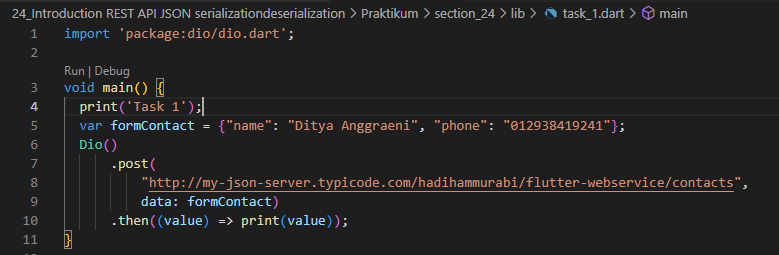
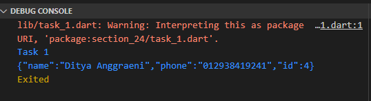
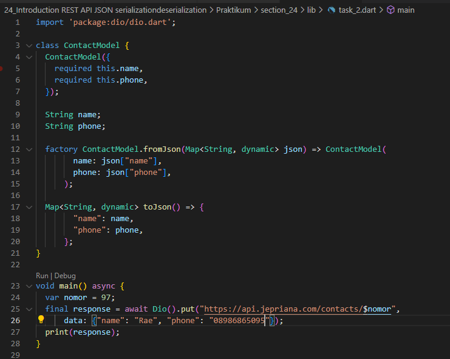
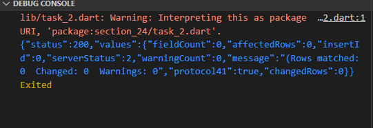

# 24_Introduction REST API - JSON serialization/deserialization

Nama : Ditya Anggraeni

Program : Become a Flutter Master, From Zero to Hero

Repo : https://github.com/Rae2108/flutter_ditya-anggraeni

## Tuliskan 3 poin yang dipelajari dari materi tersebut. Resume / ringkasan materi dapat disubmit melalui Github

### Jawab : 

1. Rest API ( Representation State Transfer Aplication) merupakan arsitektural yang memisahkan tampilan dengan proses bisnis, bagian tampilan dengan proses bisnis berkirim data melalui HTTP Request. 

2. HTTP merupkan protokol yang digunakan untuk berkirim data pada internet, biasanya data tersebut berbentuk media web. pola komunikasi dapat dengan client mengirim request dan server mengolah dan membalas dengan memberi response. 

3. DIO merupakan sebagai HTTP Client dan dimanfaatkan untuk melakukan REST API

============================================================================================

## TASK

- [task1.PNG](./Screenshots/task1.PNG)

## OUTPUT 

- [outputtask1.PNG](./Screenshots/outputtask1.PNG)

- [task2.PNG](./Screenshots/task2.PNG)

## OUTPUT 

- [outputtask2.PNG](./Screenshots/outputtask2.PNG)
