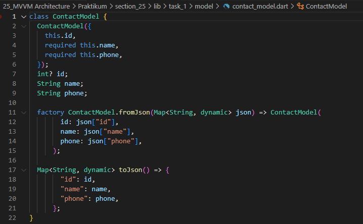

# 25_MVVM Architecture

Nama : Ditya Anggraeni

Program : Become a Flutter Master, From Zero to Hero

Repo : https://github.com/Rae2108/flutter_ditya-anggraeni

## Tuliskan 3 poin yang dipelajari dari materi tersebut. Resume / ringkasan materi dapat disubmit melalui Github

### Jawab : 

1. MVVM (Model View View Model) yang memisahkan logic dengan tampilan (View) kedalam ViewModel. 

Keuntungan MVVM : 
    - Reusability
    - Maintanability
    - Testbility

2. Struktur Directory MVVM :
    - Model memiliki 2 bagian, yaitu bentuk data yang akan digunakan dan sumber dari data tersebut
    - tiap screen diletakkan dalam sebuah directori yang didalamnya terdapat view dan ViewModel.

3. Model merupakan bentuk data yang akan digunakan, dibuat dalam bentuk class ddan data - data yang dimuat diletakkan pada property. 

============================================================================================

## TASK

- [conapi.PNG](./Screenshots/conapi.PNG)

Kode yang digunakan untuk pengambilan data dari API.

- [conmodel.PNG](./Screenshots/conmodel.PNG)

Kode yang digunakan untuk membuat sebuah model untuk kontak.

- [conscreen1.PNG](./Screenshots/conscreen1.PNG) [conscreen1_1.PNG](./Screenshots/conscreen1_1.PNG) [conscreen1_2.PNG](./Screenshots/conscreen1_2.PNG)
  

- [conview.PNG](./Screenshots/conview.PNG)

Kode yang digunakan untuk menampilkan semua yang ada di model.

- [createcon2.PNG](./Screenshots/createcon2.PNG) [createcon2_1.PNG](./Screenshots/createcon2_1.PNG) [createcon2.PNG](./Screenshots/createcon2_2.PNG)
 [createcon2_1.PNG](./Screenshots/createcon2_1.PNG) [createcon2.PNG](./Screenshots/createcon2_2.PNG)

- [customepage.PNG](./Screenshots/customepage.PNG)

- [detailcon2.PNG](./Screenshots/detailcon2.PNG) [detailcon2_1.PNG](./Screenshots/detailcon2_1.PNG) [detailcon2_2.PNG](./Screenshots/detailcon2_2.PNG)
  

- [main.PNG](./Screenshots/main.PNG)

- [widgettest.PNG](./Screenshots/widgettest.PNG)

Dengan menggunakan MVVM arsitektur perintah logic dapat digunakan kembali sehingga tidak ada terjadinya pemborosan kode dan kode double.