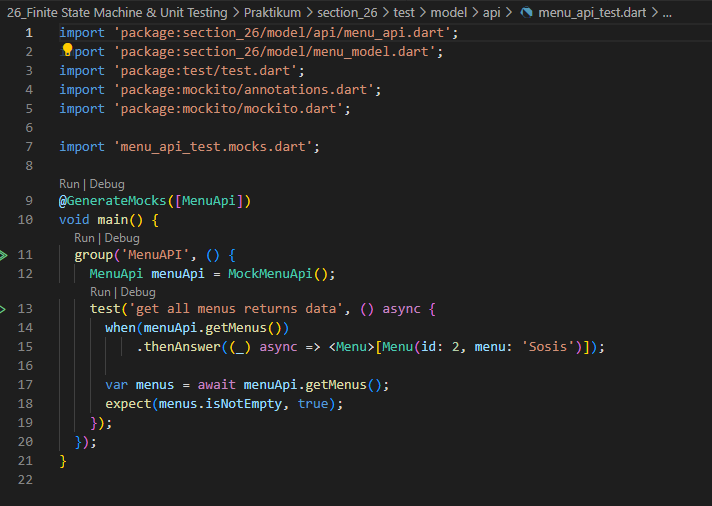

# 26_Finite State Machine & Unit Testing

Nama : Ditya Anggraeni

Program : Become a Flutter Master, From Zero to Hero

Repo : https://github.com/Rae2108/flutter_ditya-anggraeni

## Tuliskan 3 poin yang dipelajari dari materi tersebut. Resume / ringkasan materi dapat disubmit melalui Github

### Jawab : 

1. Finite State Machine merupakan mesin yang memiliki sejumlah state dan setiap state menunjukkan apa yang terjadi sebelumnya.

Contoh kejadian dalam suatu proses :
    - IDDLE saat tidak terjadi proses
    - RUNNING saat proses sedang berjalan
    - ERROR saat proses gagal diselesaikan

2. Menambah Enum 
    - membuat enum untuk masing - masing state
        - none saat IDDLE
        - Loading saat RUNNING
        - Error saat ERROR

3. Unit test merupakan salah satu jenis pengujian pada perangkat lunak, unit ini merupakan fungsi atau method.

Tujuan dari Unit Test :
    - memastikan Fungsi dapat mengolah berbagai jenis input
    - Memastikan hasil dari suatu fungsi atau method sudah sesuai
    - menjadi dokumentasi

============================================================================================

## TASK

- [menuapi.PNG](./Screenshots/menuapi.PNG)

- [menumodel.PNG](./Screenshots/menumodel.PNG)

- [menuscreen1.PNG](./Screenshots/menuscreen1.PNG) [menuscreen2.PNG](./Screenshots/menuscreen2.PNG) [menuscreen3.PNG](./Screenshots/menuscreen3.PNG)
  

- [menuview.PNG](./Screenshots/menuview.PNG)

- [main.PNG](./Screenshots/main.PNG)

- [apitest.PNG](./Screenshots/apitest.PNG)

- [apitest2.PNG](./Screenshots/apitest2.PNG)
