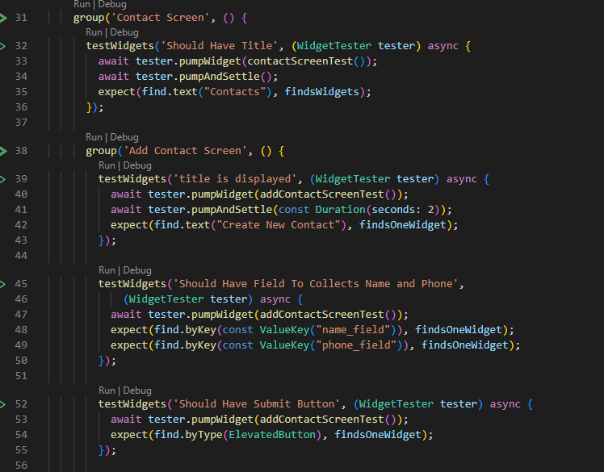
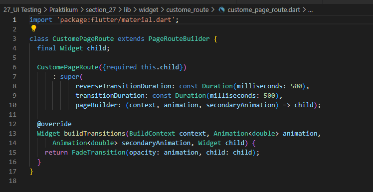

# 27_UI Testing

Nama : Ditya Anggraeni

Program : Become a Flutter Master, From Zero to Hero

Repo : https://github.com/Rae2108/flutter_ditya-anggraeni

## Tuliskan 3 poin yang dipelajari dari materi tersebut. Resume / ringkasan materi dapat disubmit melalui Github

### Jawab : 

1. UI Testing merupakan pengujian yang dilakukan pada tampilan suatu aplikasi untuk memastikan aplikasi dapat menerima interaksi dan memberi respon kepada pengguna. 

2. Keuntungan UI Testing : 
    - memasikan seluruh widget memberi tampilan yang sesuai
    - memastikan seluruh interaksi dapat diterima dengan baik
    - menjadi ketentuan yang harus diikuti saat diperlukan perubahan pada widget. 

3. UI Testing di Flutter disebut juga widget testing sehingga pengujian dilakukan pada widgets dengan menuliskan script yang dapat dijalankan secara otomatis. 

============================================================================================

## TASK

- [addcon1.PNG](./Screenshots/addcon1.PNG) [addcon1_1.PNG](./Screenshots/addcon1_1.PNG) [addcon1_2.PNG](./Screenshots/addcon1_2.PNG)
  

- [blankscreen.PNG](./Screenshots/blankscreen.PNG)

- [conapi.PNG](./Screenshots/conapi.PNG)

- [conmodel.PNG](./Screenshots/conmodel.PNG)

- [conscreen1.PNG](./Screenshots/conscreen1.PNG) [conscreen1_1.PNG](./Screenshots/conscreen1_1.PNG) [conscreen1_2.PNG](./Screenshots/conscreen1_2.PNG) [conscreen1_3.PNG](./Screenshots/conscreen1_3.PNG)
   

- [conscreentest1.PNG](./Screenshots/conscreentest1.PNG) [conscreentest2.PNG](./Screenshots/conscreentest2.PNG) [conscreentest3.PNG](./Screenshots/conscreentest3.PNG) [conscreentest4.PNG](./Screenshots/conscreentest4.PNG) [conscreentest5.PNG](./Screenshots/conscreentest5.PNG) 

     

- [conview1.PNG](./Screenshots/conview1.PNG) [conview1_1.PNG](./Screenshots/conview1_1.PNG)
 

- [customepage.PNG](./Screenshots/customepage.PNG)

- [editcon1.PNG](./Screenshots/editcon1.PNG) [editcon1_1.PNG](./Screenshots/editcon1_1.PNG) [editcon1_2.PNG](./Screenshots/editcon1_2.PNG)
  

- [main.PNG](./Screenshots/main.PNG)

## OUTPUT
- [output.png](./Screenshots/output.png)

- [output2.PNG](./Screenshots/output2.PNG)
