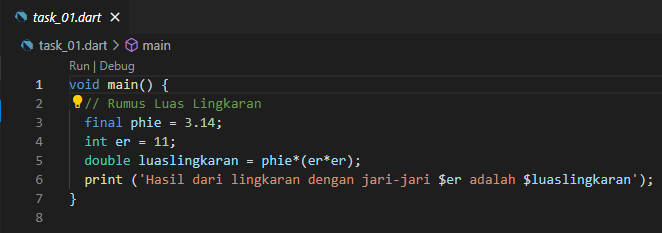
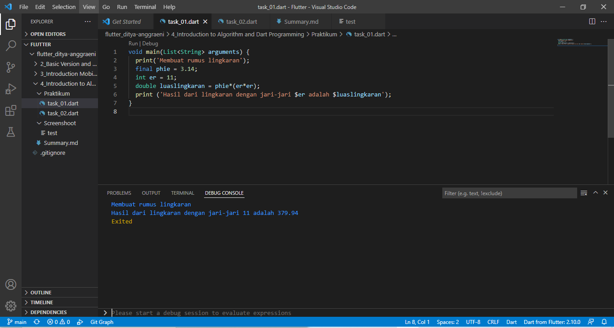
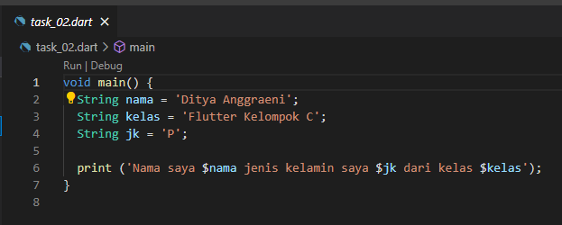
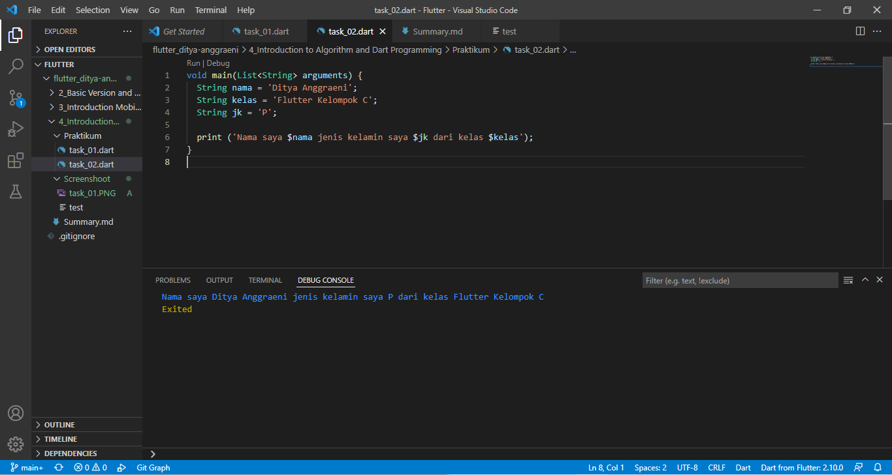

# 4_Introduction to Algorithm and Dart Programming

Nama : Ditya Anggraeni

Program : Become a Flutter Master, From Zero to Hero

Repo : https://github.com/Rae2108/flutter_ditya-anggraeni

## RESUME
## Tuliskan 3 poin yang dipelajari dari materi tersebut. Resume / ringkasan materi dapat disubmit melalui Github

### Jawab : 

1. Apa itu dart ? Dart merupakan bahas pemrograman yang bersifat open soure yang dimana memudahkan seorang programmer dalam mengakses dengan cepat. Dart di ciptakanawalnya untuk mengganti bahasa pemrograman JavaScript yang dimana javaScript memiliki banyak kelemahan. Sejak adanya flutter dart semakin berkembang. 

2. Pada vidio ini membahas bagaimana cara menggunakan dart di dalam VSC. Terdapat fungsi main yang dimana merupakan bagian yang pertama kali di dalam dart. Dart memiliki tipe data sederhana yang disebut primitive data type. Terdapat type data pada dart seperti int untuk bilangan bulat, double untuk bilangan pecahan, bool untuk perintah true/false, string untuk teks.

3. Terdapat perintah komentar yang dimana berfungsi untuk memberikan perintah tanpa mengganguu program utama, biasanya perintah komentar di simbolkan dengan simbol “//” atau (/*)(*/). 

============================================================================================
## TASK 
1. pada pertemuan kali ini adalah membahas tentang bagaimana cara menggunakan dart, dengan adanya task cara membuat luas lingkaran dengan program dart maka dapat menggunakan program seperti di bawah ini :  
[prog_01.PNG](./Screenshoot/prog_01.PNG) 

pada program di atas dimana terdapat nilai final (tidak dapat di ubah) phi dengan nilai 3,14 yang bernilai integer dengan r nya adalah 11. untuk luas lingkarannya sendiri menggunakan tipe data double yang dimana rumusnya adalah phie*(er*er) lalu print hasil dari luas lingkaran tersebut. maka akan di peroleh output seperti di bawah ini. 

output:

2. pada program nomor 2 ini adalah membuat 3 string lalu di sambungkan ketiganya, disini saya membuat string dengan variabel nama, kelas, jk. 

[prog_02.PNG](./Screenshoot/prog_02.PNG) 

untuk nama sendiri saya isi dengan 'Ditya Anggraeni', kelas ' Flutter Kelompok C' dan jk 'P' yang nantinya akan di print dan menghasilkan output seperti di bawah ini.   
output:

