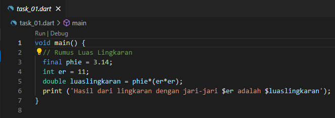
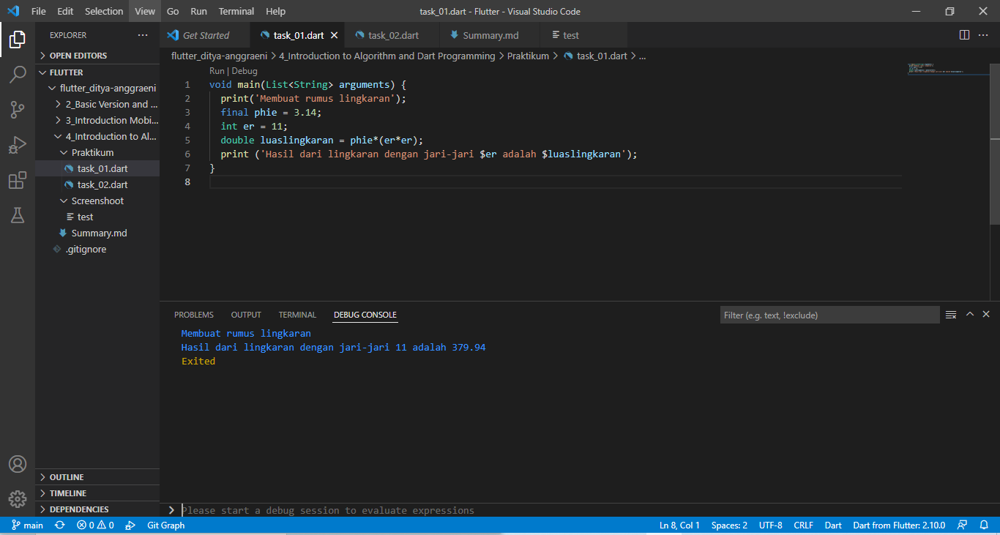
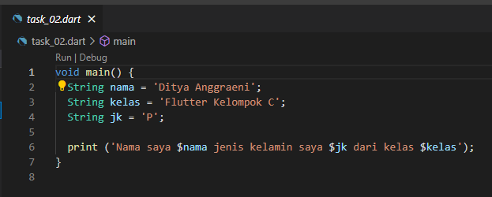
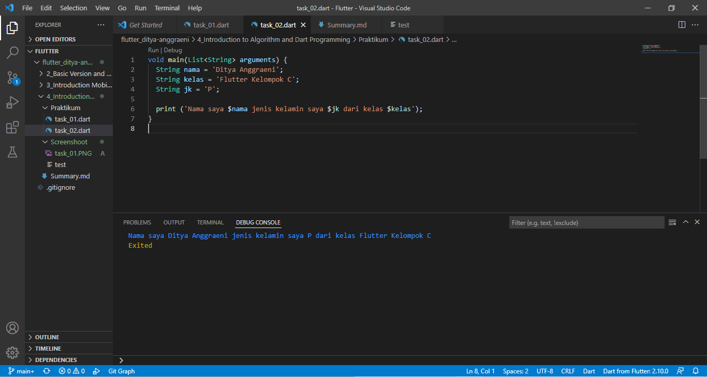

# 5_Basic Dart Programming

Nama : Ditya Anggraeni

Program : Become a Flutter Master, From Zero to Hero

Repo : https://github.com/Rae2108/flutter_ditya-anggraeni

## Tuliskan 3 poin yang dipelajari dari materi tersebut. Resume / ringkasan materi dapat disubmit melalui Github

### Jawab : 

1.Anonymous Function merupakan fungsi yang tidak memiliki nama,  Anonymous Function sendiri bisa di buat sebagai data di parameternya. Dalam membuat fungsi kita juga dapat menggunakan Arrow Function supaya lebih ringkat, dengan Arrow Function sendiri kita dapat memiliki nama atau tidak, berisi 1 data (dari proses maupun data statis), dan nilai return fungsi ini diambil dari data tersebut.

2.Async Await dapat menjalankan beberapa proses tanpa perlu menunggu lalu proses di tulis dalam bentuk fungsi kemudian Await akan menunggu hingga proses async selesai.

3.Fungsi data Future merupakan tipe data yang dapat di tunggu atau di beri waktu, dan jika ingin mengembalikan data return kita dapat membawanya dari fungsi async  

============================================================================================

## TASK 

1. pada pertemuan kali ini adalah membahas tentang bagaimana cara menggunakan dart, dengan adanya task cara membuat luas lingkaran dengan program dart maka dapat menggunakan program seperti di bawah ini :  
[prog_01.PNG](./Screenshoot/prog_01.PNG) 

pada program di atas dimana terdapat nilai final (tidak dapat di ubah) phi dengan nilai 3,14 yang bernilai integer dengan r nya adalah 11. untuk luas lingkarannya sendiri menggunakan tipe data double yang dimana rumusnya adalah phie*(er*er) lalu print hasil dari luas lingkaran tersebut. maka akan di peroleh output seperti di bawah ini. 

output:

2. pada program nomor 2 ini adalah membuat 3 string lalu di sambungkan ketiganya, disini saya membuat string dengan variabel nama, kelas, jk. 

[prog_02.PNG](./Screenshoot/prog_02.PNG) 

untuk nama sendiri saya isi dengan 'Ditya Anggraeni', kelas ' Flutter Kelompok C' dan jk 'P' yang nantinya akan di print dan menghasilkan output seperti di bawah ini.   
output:

