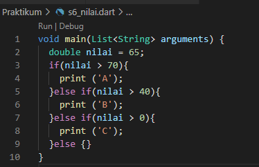
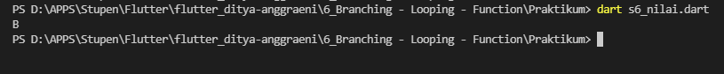
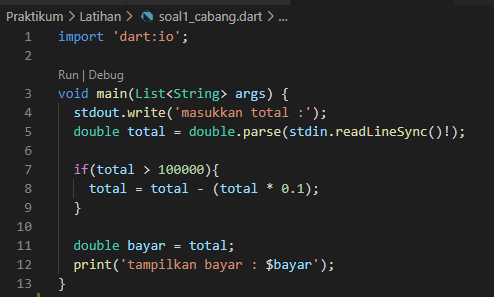
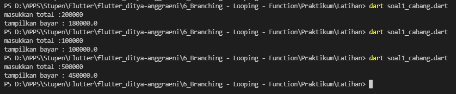
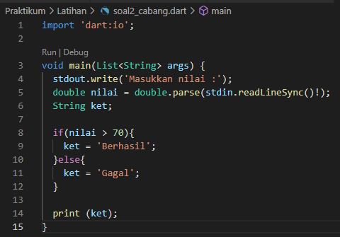
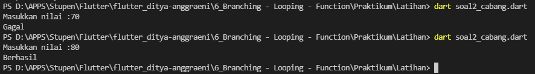
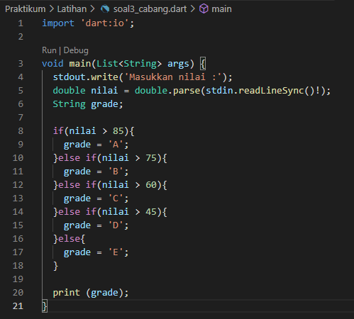
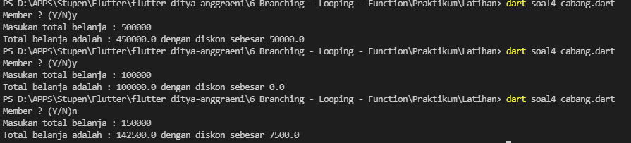
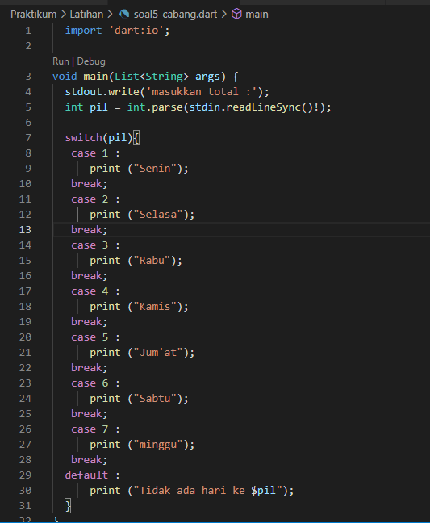
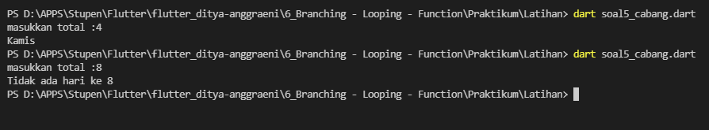

# 6_Brancing-Looping-Fungction

Nama : Ditya Anggraeni

Program : Become a Flutter Master, From Zero to Hero

Repo : https://github.com/Rae2108/flutter_ditya-anggraeni

## Tuliskan 3 poin yang dipelajari dari materi tersebut. Resume / ringkasan materi dapat disubmit melalui Github

### Jawab : 

1. pada proses pengambian keputusan terdapat percabangan yang bisa menggunakan perintah If, If-else, dan else if.

2. ada juga perintah perulangan yang bisa menggunakan perintah for, while, do-while, dan cara untuk menghentikan perulangan bisa menggunakan perintah break dan continue

3. pada materi ini juga terdapat cara bagaimana membuat dan memanggil fungsi.

============================================================================================

## TASK 

pada pertemuan di section 6 kali ini adalah memabahas mengenai braching, looping, dan function. kali ini diberikan 2 soal. pada soal nomor 1

[task_01.png](./screenshot/task_01.png) 

 

 

1. pada pertemuan kali ini adalah membahas tentang bagaimana cara menggunakan dart, dengan adanya task cara membuat luas lingkaran dengan program dart maka dapat menggunakan program seperti di bawah ini :  
[soal1.png](./screenshot/soal1.png) 

 

pada program di atas dimana terdapat nilai final (tidak dapat di ubah) phi dengan nilai 3,14 yang bernilai integer dengan r nya adalah 11. untuk luas lingkarannya sendiri menggunakan tipe data double yang dimana rumusnya adalah phie*(er*er) lalu print hasil dari luas lingkaran tersebut. maka akan di peroleh output seperti di bawah ini. 

output:

 

2. pada program nomor 2 ini adalah membuat 3 string lalu di sambungkan ketiganya, disini saya membuat string dengan variabel nama, kelas, jk. 

[soal2.png](./screenshot/soal2.png) 

untuk nama sendiri saya isi dengan 'Ditya Anggraeni', kelas ' Flutter Kelompok C' dan jk 'P' yang nantinya akan di print dan menghasilkan output seperti di bawah ini.   
output:

3. 
[soal3.png](./screenshot/soal3.png) 

4. 
[soal4.png](./screenshot/soal4.png) 

5. 
[soal5.png](./screenshot/soal5.png) 

