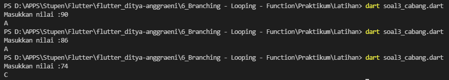
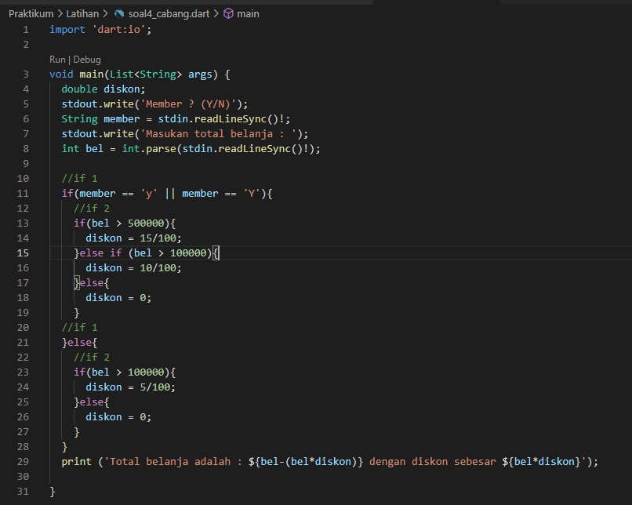

# 6_Brancing-Looping-Fungction

Nama : Ditya Anggraeni

Program : Become a Flutter Master, From Zero to Hero

Repo : https://github.com/Rae2108/flutter_ditya-anggraeni

## Tuliskan 3 poin yang dipelajari dari materi tersebut. Resume / ringkasan materi dapat disubmit melalui Github

### Jawab : 

1. pada proses pengambian keputusan terdapat percabangan yang bisa menggunakan perintah If, If-else, dan else if.

2. ada juga perintah perulangan yang bisa menggunakan perintah for, while, do-while, dan cara untuk menghentikan perulangan bisa menggunakan perintah break dan continue

3. pada materi ini juga terdapat cara bagaimana membuat dan memanggil fungsi.

============================================================================================

## TASK 

pada pertemuan di section 6 kali ini adalah memabahas mengenai braching, looping, dan function. kali ini diberikan 2 soal. pada soal nomor 1 dimana saya disini sudah menentukan nilai yaitu 65 dengan kondisi jika nilai di atas 70 maka akan mendapat nilai A, jika di atas 40 akan mendapat nilai B dan jika nilai 0 maka akan mendapat nilai C. 

[task_01.png](./screenshot/task_01.png) 

 

karena disini saya menginputkan nilai 65 maka hasil yang keluar adalah nilai B. 

 

pada soal nomor 2 adalah terdapat soal untuk menentukan nilai faktorial yang dimana sudah di tentukan yaitu nilai faktorial 10, 20, dan 30. 

[task_02.png](./screenshot/task_02.png) 

disini saya memakai fungsi dengan variabel a yang memakai tipe data double. dan untuk i = 1; merupakan nilai awal i <= a jika fungsi a lebih besar sama dengan a maka nilai akan bertambah . 

 

berikut adalah output dari fungsi tersebut. 

 

############################################################################################################

## Soal Latihan (Percabangan)

1.  [soal1.png](./screenshot/soal1.png) 

 

 pada program diatas terdapat percabangan if yang dimana jika total lebih besar dari 100000 maka akan mendapatkan diskon 10%. yang dimana total = total - (total * 0.1);

output:

 

2.   [soal2.png](./screenshot/soal2.png) 

pada program di atas terdapat if jika nilai lebih besar dari 70 maka akan memberikan keterangan berhasil, jika nila 70 maka akan memberikan keterangan gagal dan jika di bawah 70 juga akan memberikan keterangan gagal. 

berikut adalah outputnya : 

3.  [soal3.png](./screenshot/soal3.png) 

pada kodingan diatas diminta jika nilai lebih besar dari 85 maka akan mendapatkan grade A jika kurang dari 85 maka akan mendapatkan grade B dan jika kurang dari 75 maka akan mendapatkan grade C dan jika kurang dari 60 maka akan mendapatkan grade D jika kurang dari 45 maka akan mendapatkan grade E. 

4.  [soal4.png](./screenshot/soal4.png) 

pada kodingan di atas menjelaskan alur apakah kamu memiliki member? jika iya apakah belanja lebih dari 500000 jika iya maka akan mendapatkan diskom 15% jika tidak dan belanjanya lebih dari 100000 maka akan mendapatkan diskon 10% dan jika kurang dari 100000 maka tidak mendapatan diskon. jika tidak memiliki member dan belanja lebih dari 100000 maka akan mendapatkan diskon 5%. 

5.  [soal5.png](./screenshot/soal5.png) 

pada kodingan di atas adalah membuat program dengan percabangan Switch case, yang dimana disini menggunakan nama hari yang jika di input nilai 1 maka akan memunculkan hari senin, angka 2 hari selasa dan seterusnya. jika diinputkan angka lebih dari 7 maka akan masuk ke else yang dimana angka tersebut tidak di temukan. 

############################################################################################################

## Soal Latihan (Peruangan)

## Soal Latihan (Fungsi)