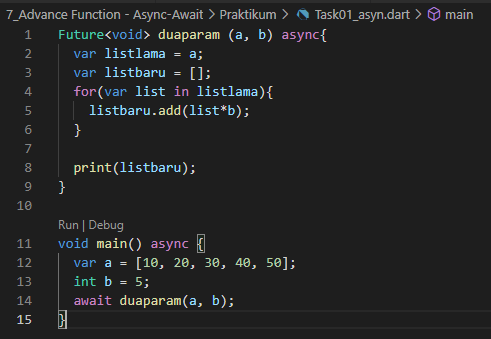
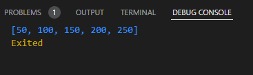
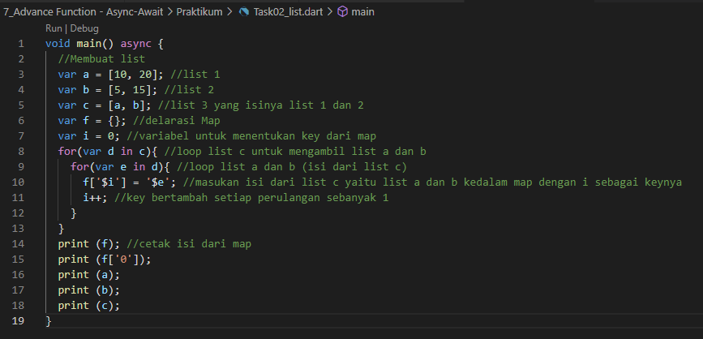
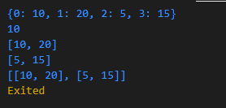

# 7_Advance Function - Async-Await

Nama : Ditya Anggraeni

Program : Become a Flutter Master, From Zero to Hero

Repo : https://github.com/Rae2108/flutter_ditya-anggraeni

## Tuliskan 3 poin yang dipelajari dari materi tersebut. Resume / ringkasan materi dapat disubmit melalui Github

### Jawab : 

1. Anonymous Function dapat di deklarasikan ketika tidak memiliki nama, function ini juga dapat digunakan untuk parameternya.

2. Async-Await dapat di jalankan secara asyncronus tanpa menunggu proses lainnya selesai. proses dengan Await akan menunggu hingga proses async nya selesai. 

3. Collection merupakan kumpulan data pada suatu tempat. contohnya seperti list dan Map. 

============================================================================================

## TASK 

 
1. [task01.PNG](./Screenshots/task01.PNG) 

output:

2. [task02.PNG](./Screenshots/task02.PNG) 

output:

