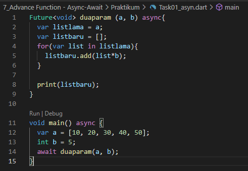
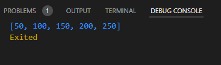
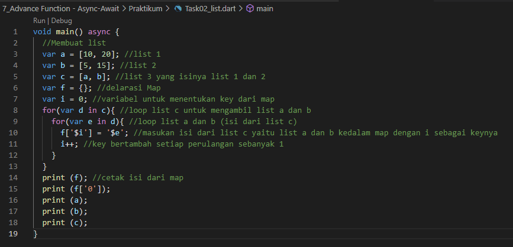
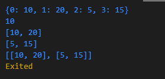

# 8_Collection

Nama : Ditya Anggraeni

Program : Become a Flutter Master, From Zero to Hero

Repo : https://github.com/Rae2108/flutter_ditya-anggraeni

## Tuliskan 3 poin yang dipelajari dari materi tersebut. Resume / ringkasan materi dapat disubmit melalui Github

### Jawab : 

1. Anonymous Function dapat mendeklarasikan fungsinya yang tidak memiliki nama, dapat dibuat sebagai data parameter, dapat membuat dungsi dengan Arraw Function, dapat memiliki nama atau tidak, berisi 1 data (dari proses maupun data statis), nilai return fungsi ini diambil dari data tersebut.

2. Async - Await :
    - dapat menjalankan beberapa proses tanpa perlu menunggu
    - proses di tulis dalam bentuk fungsi
    - await akan menunggu sampai proses async selesai

3. Tipe Data Future
    - Dapat menunggu suatu proses berjalannya fungsi di beri waktu atau durasi
    - jika ingin mengembalikan data (return) dapat menggunakan async

4. Collection merupakan struktur data yang canggih dan dapat menangani masalah yang lebih kompleks, terpat list dan map pada collection. 

============================================================================================

## TASK 

 
1. [task01.PNG](./Screenshots/task01.PNG) 

Deklarasiin terlebih dahulu listbaru dan listlama, list baru berisikan a yang dimana a didapat dari parameter fungsi duaparam. Untuk mengalikan list, saya ambil satu persatu isi dari list tersebut menggunakan for kemudian saya kalikan dengan yang sudah ditentukan setelah dikalikan maka setiap isi dari list tersebut dikembalikan ke index lama

output:

2. [task02.PNG](./Screenshots/task02.PNG) 

pada program di atas adalah kita membuat fungsi list dengan asyn. yang dimana kita di minta untuk membuat map dengan menggunakan list yang sudah di deskripsikan. terdapat list 1 list 2 dan list 3 yang dimana list 3 bisa di lihat isinya dari list 1 dan 2. kemudian menentukan map nya lalu pada for pertama digunakan untuk looping list c yang mengambil nilainya dari list a dan b. kemudian for kedua adalah loop list a dan b yang isi listnya dari list c. 

output:

