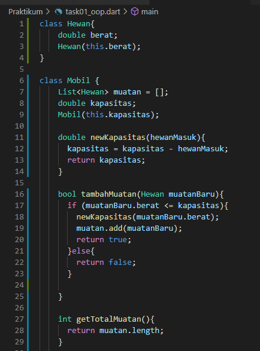
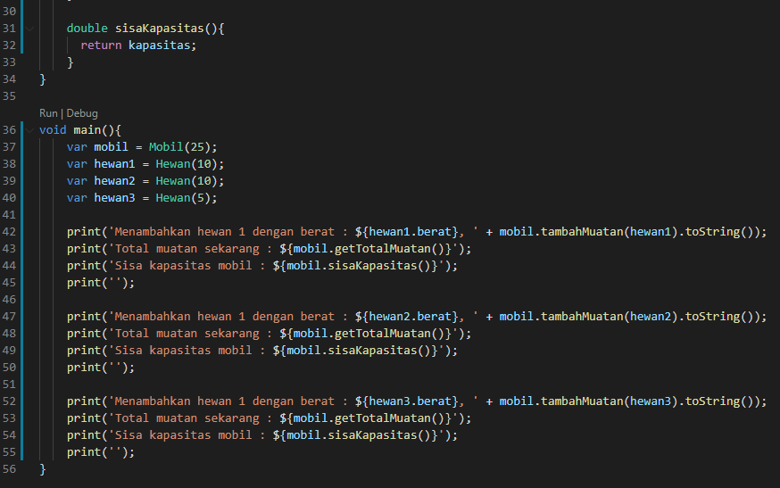
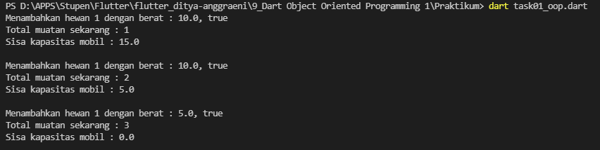

#9_Dart Object Oriented Programming 1

Nama : Ditya Anggraeni

Program : Become a Flutter Master, From Zero to Hero

Repo : https://github.com/Rae2108/flutter_ditya-anggraeni

## Tuliskan 3 poin yang dipelajari dari materi tersebut. Resume / ringkasan materi dapat disubmit melalui Github

### Jawab : 

1. Object Oriented Programming merupakan paradigma pemrograman yang berkonsep objek yang dapat membuat objek di dunia nyata ke dalam dunia komputer.
OOP dapat disusun dalam abstraksi objek, data dan proses dapat di letakkan pada OOP nya.

2. Keuntungan OOP :
    - Dapat di terapkan saat terjadi troubleshoot ketika error 
    - mudah digunakan ulang
    - pemrograman OOP dapat di temukan di bahasa pemrograman C++, Java, Javascript, dan python.
    - OOP memiliki beberapa bagian di antaranya : class, object, property, method, inheritance, dan generics.

3. Class merupakan abstraksi objek dari sebuah benda, memiliki ciri - ciri yang disebut property, memiliki sifat dan kemampuan  yang di sebut method. 

============================================================================================

## TASK 

 
[task01.PNG](./Screenshots/task01.PNG) 
[task02.PNG](./Screenshots/task02.PNG)

 

output:

 

 

 

