# Section 2 Basic Version and Branch Management (Git)
Nama : Ditya Anggraeni

Program : Become a Flutter Master, From Zero to Hero

## Tugas : Resume Section 2 (Basic Version and Branch Management (Git))

### Tuliskan 3 poin yang dipelajari dari materi tersebut. Resume / ringkasan materi dapat disubmit melalui Github

### Jawab : 
1. Terdistribusi
Yang dimaksud terdistribusi disini adalah dimana pada penggunaan githab kita dapat menggunakannya secara bersama - sama jadi mempermudahkan dalam pengerjaan sebuah project.
2. Cara installasi github 
Instalasi github sangatlah penting untuk sebuah project yang akan kita lakukan bersama - sama. Maka dari itu langkah - langkah yang di berikan pada vidio sangat bermanfaat.
3. Commit Message
Commit message sangat penting sekali penamaannya agar tidak membingungkan juga saat nanti kita akan melakukan sebuah commit project. Dengan adanya commit message ini setiap dari kita akan lebih mudah jika nantinya ada kodingan yang error atau bermasalah. 

## Tugas : Task Section 2 (Basic Version and Branch Management (Git))

1. Pertama  membuat repository pada github, pada github kita menuju ke menu code yang dimana ada Https lalu ada linknya dan kemudian kita copy, setelah kita copy selanjutnya adalah kita membuka Visual studio Code. 

[Picture1.png](./Screenshoot/Picture1.png)

output :
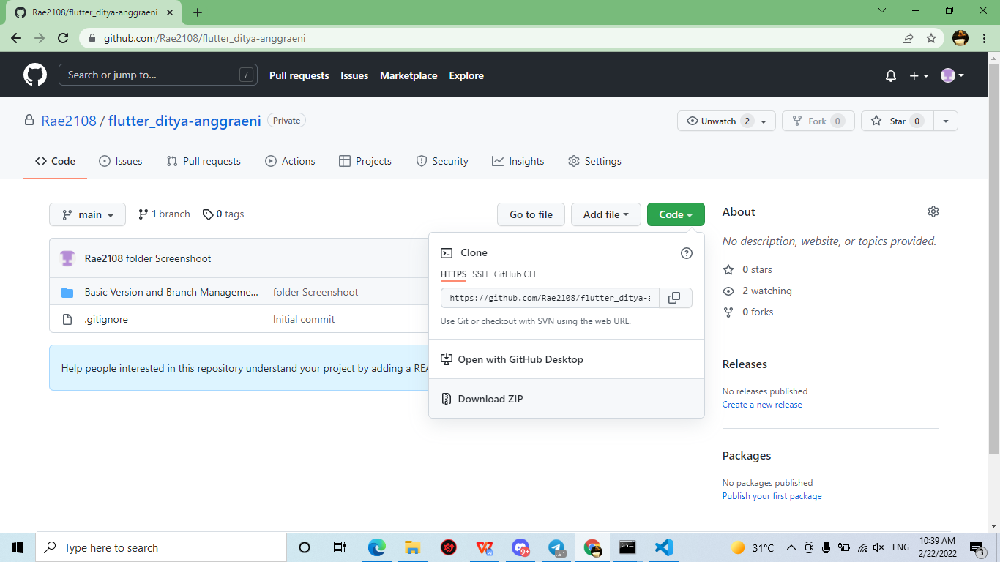

2.Sebelum kita ke VScode, kita harus membuat folder terlebih dahulu disini saya membuat folder task2_repo yang didalamnya ada file repo saya yang di github. 

[Picture2.png](./Screenshoot/Picture2.png)

output :
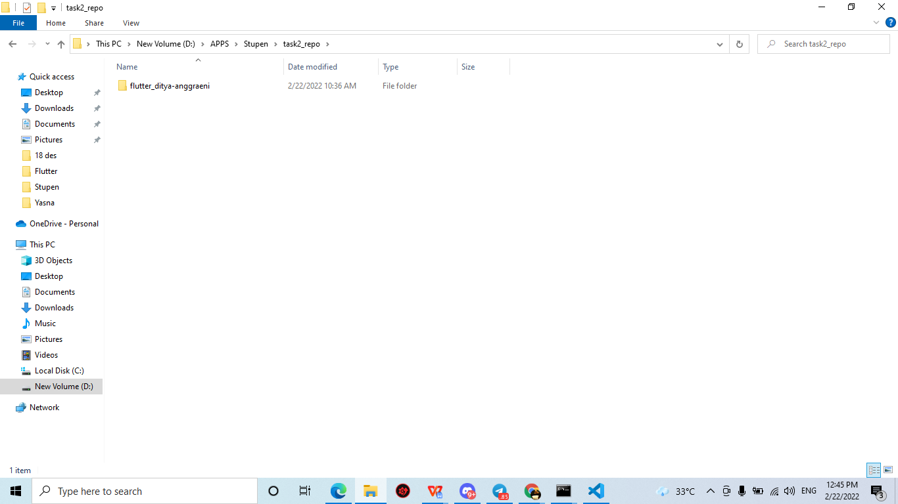

3.Setelah itu kita klik pada bar nya dengan perintah cmd nanti akan keluar tab cmd nya  seperti dibawah ini, kemudian kita tuliskan perintah code . untuk ditujukan ke VScode nya. 

[Picture3.png](./Screenshoot/Picture3.png)

output :
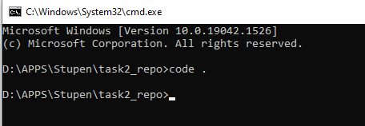

4.Kemudian akan tampil tab VScodenya  seperti gambar di bawah. Selanjutnya kita akan mengclone supaya program yang kita buat di Vscode dapat tampil pada github dengan perintah “git clone https://github.com/Rae2108/flutter_ditya-anggraeni.git” yang dimana link tersebut didapat dari code pada githubnya. 

[Picture4.png](./Screenshoot/Picture4.png)

output :
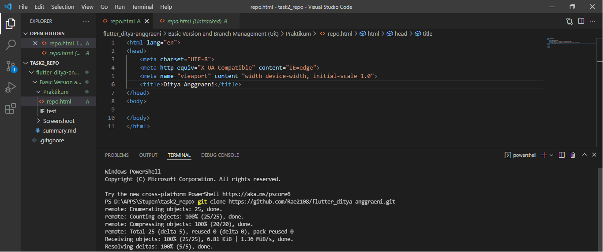

5.Lalu karena kita masih berada pada folder task2_repo maka kita keluar dulu dengan perintah cd flutter lalu tekan tombol tab dan akan pindah ke folder flutter yang kita inginkan. 

Setelah itu barulah kita dapat membuat branch yang kita inginkan. Branch yang akan kita buat ada “Master, Development, FeatureA dan FeatureB” selanjutnya untuk memulai membuat branch makakita harus keluar dlu dari branch main, dikarenakan branch main adalah branch default. 

[Picture5.png](./Screenshoot/Picture5.png)

output :
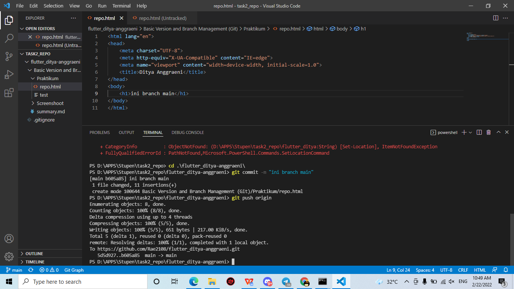

Lalu liat di githubnya maka akan muncul file repo yang sudah kita buat
[Picture6.png](./Screenshoot/Picture6.png)

output :
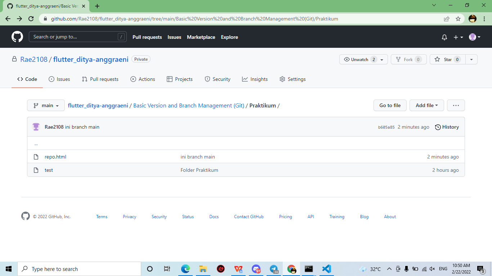

6.Selanjutnya membuat branch master dengan cara melakukan peritah “git branch master -> git checkout -> git commit -m “ini branch master” -> git push origin -u master.
[Picture7.png](./Screenshoot/Picture7.png)

output :
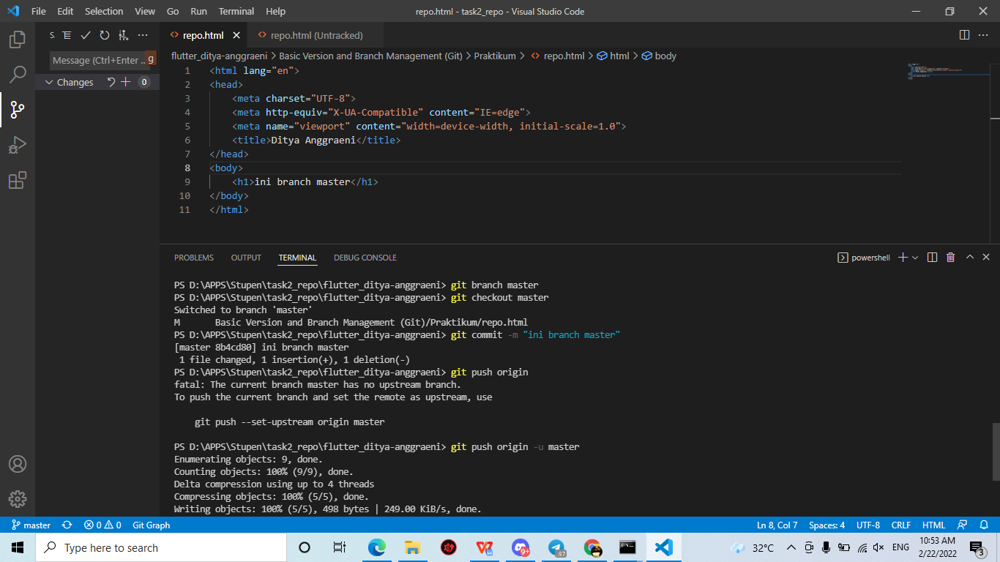

7.Lalu akan muncul branch master yang kita inginkan seperti di bwah ini (maaf saya lupa SS ketika melakukan perintah di branch master) 
[Picture8.png](./Screenshoot/Picture8.png)

output :

Pada branch master akan memberi tahukan perubahan yang di tandai dengan merah adalah perubahan lama dan hijau adalah perubahan baru. Seperti pada gambar di bawah ini.
[Picture9.png](./Screenshoot/Picture9.png)

output :
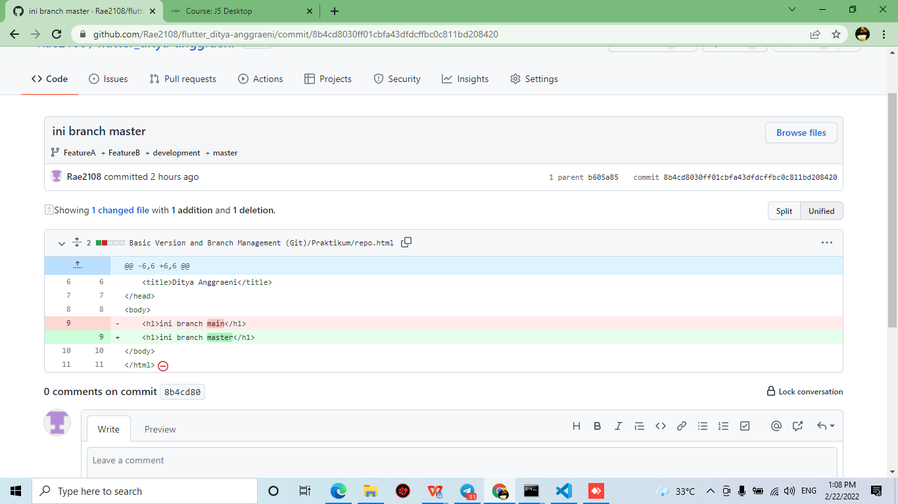
8.Untuk menambahkan branch pada “development, FeatureA dan FeatureB juga melalui step yang sama” dengan perintah seperti gambah di bawah ini.
[Picture10.png](./Screenshoot/Picture10.png)

output :

[Picture11.png](./Screenshoot/Picture11.png)

output :
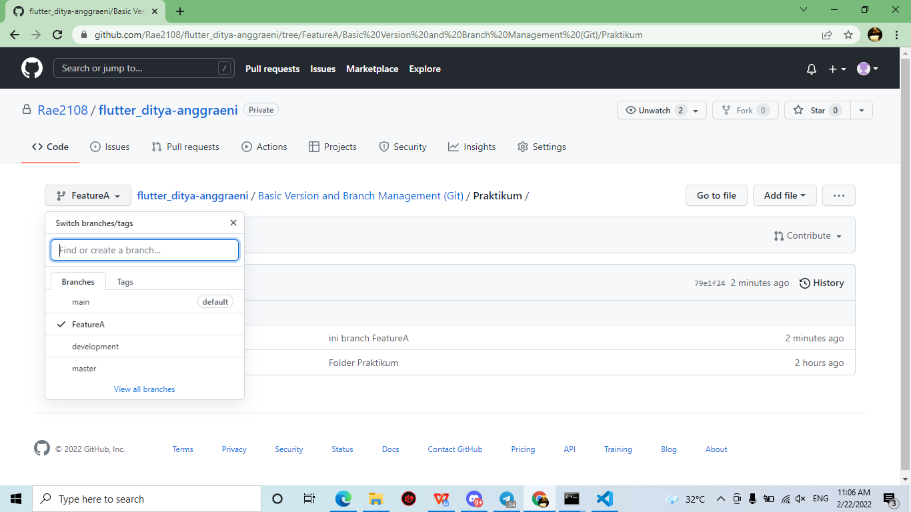

[Picture12.png](./Screenshoot/Picture12.png)

output :
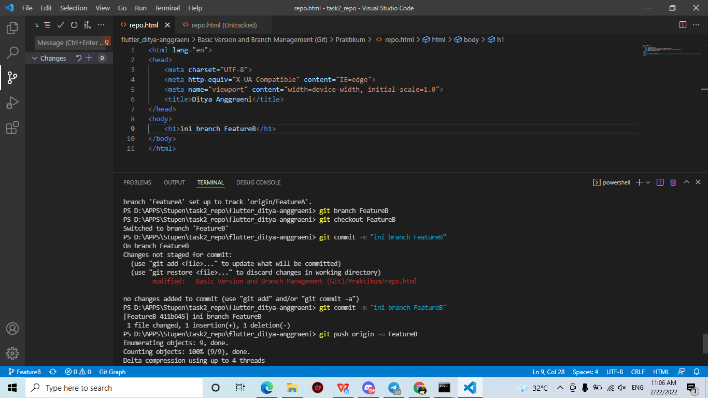

[Picture13.png](./Screenshoot/Picture13.png)

output :
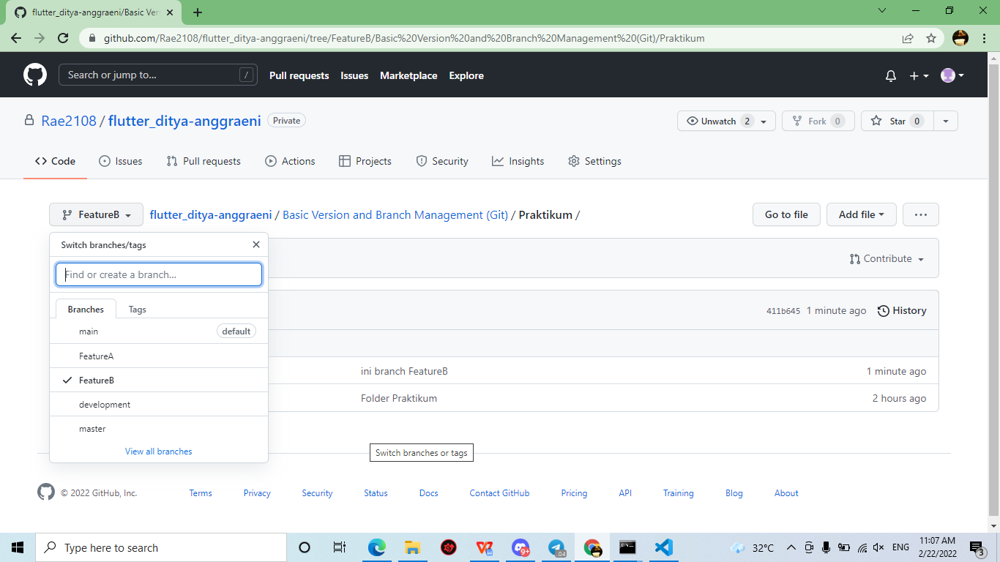

