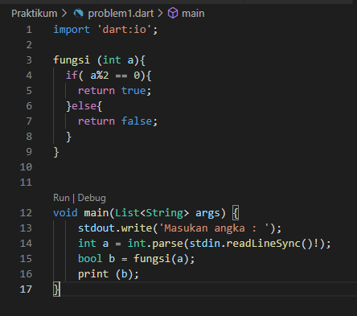
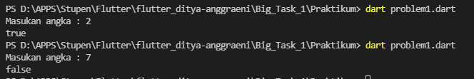
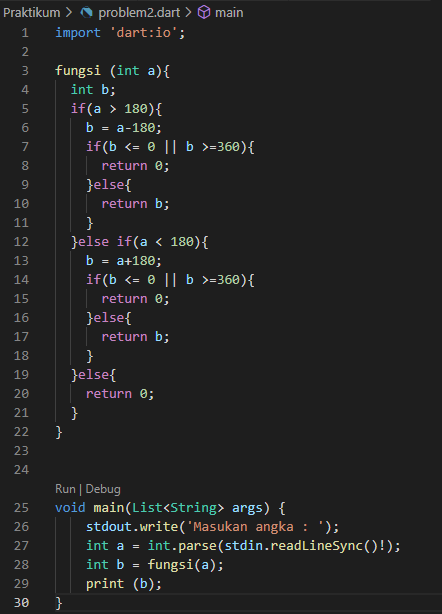
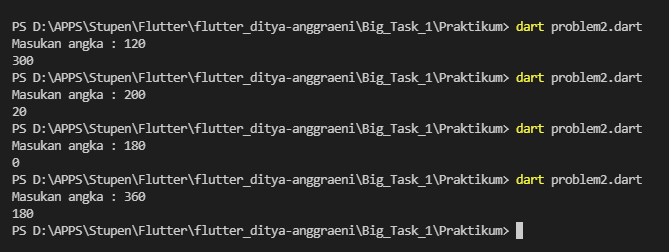
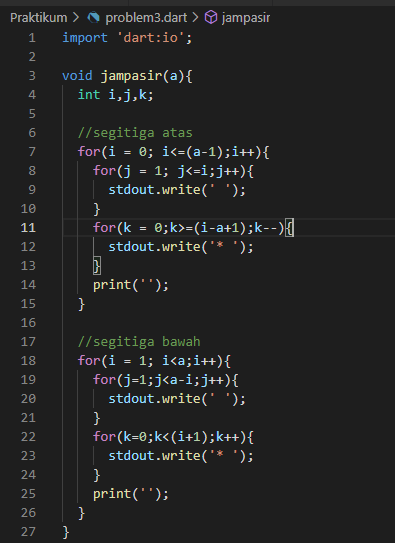
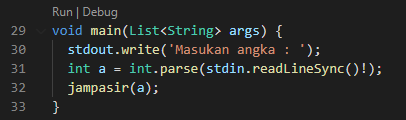
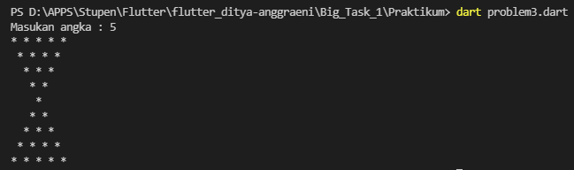
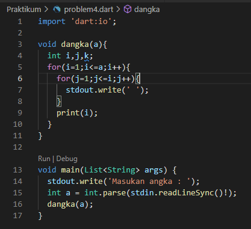

1. [problem1.PNG](./Screeenshots/problem1.PNG) 

 

output:

2. [problem2.PNG](./Screeenshots/problem2.PNG) 

 

output:

3. [problem31.PNG](./Screeenshots/problem31.PNG) 

[problem32.PNG](./Screeenshots/problem32.PNG) 

 

 

output:

4. [problem4.PNG](./Screeenshots/problem4.PNG) 

 

output:

